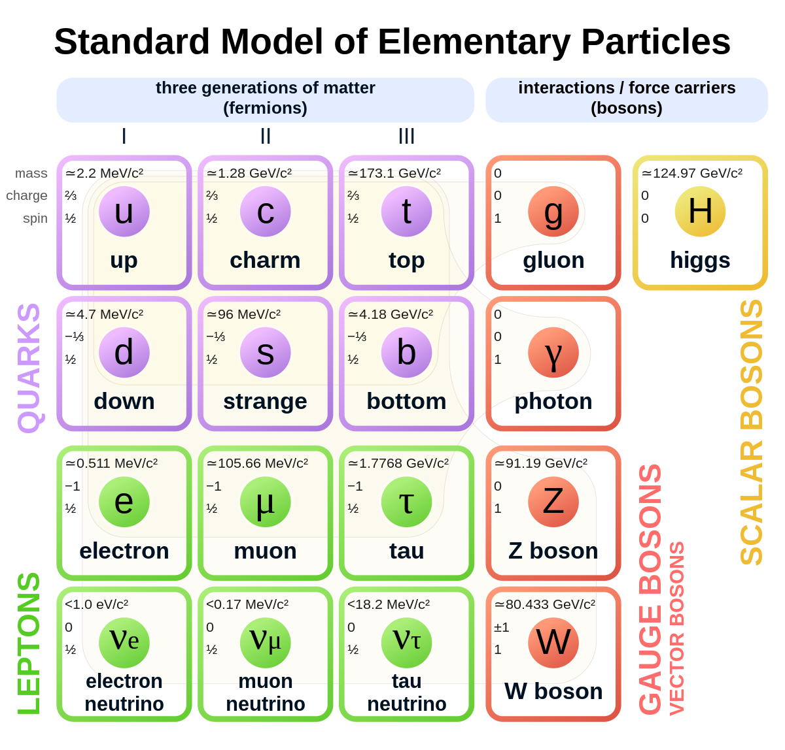
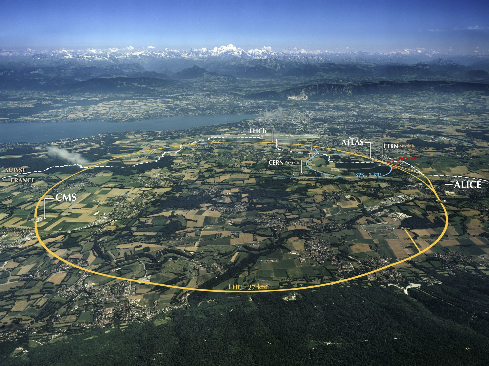
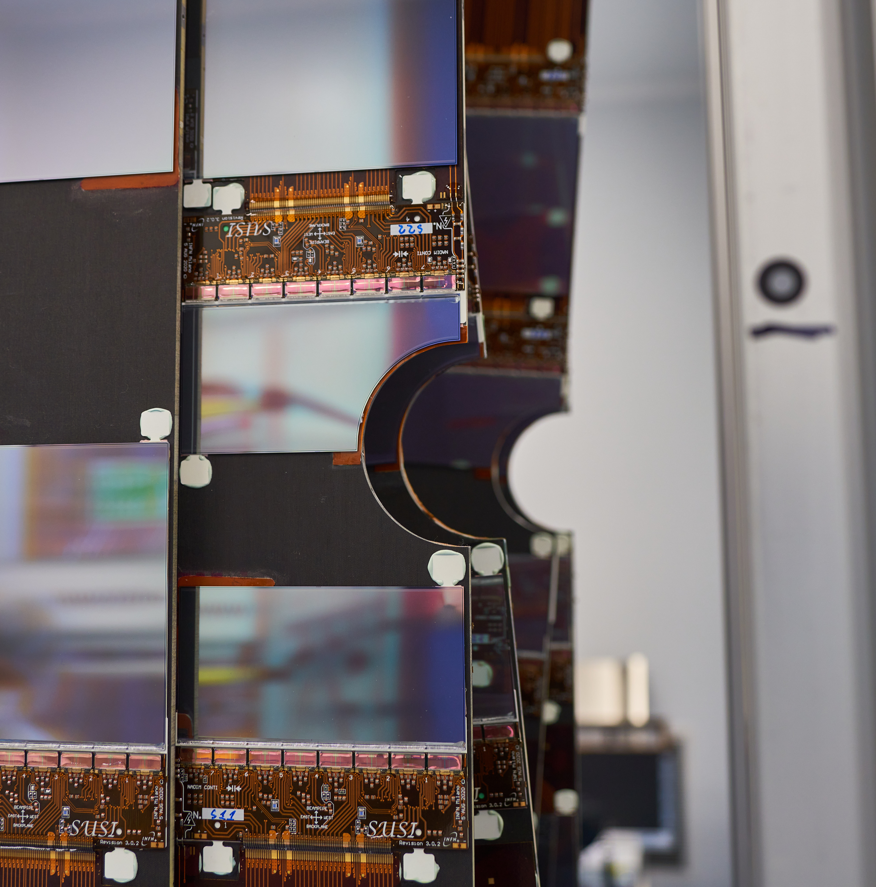
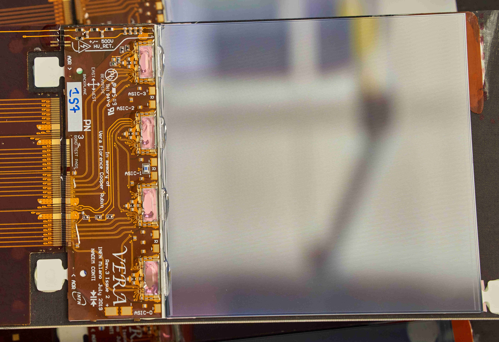
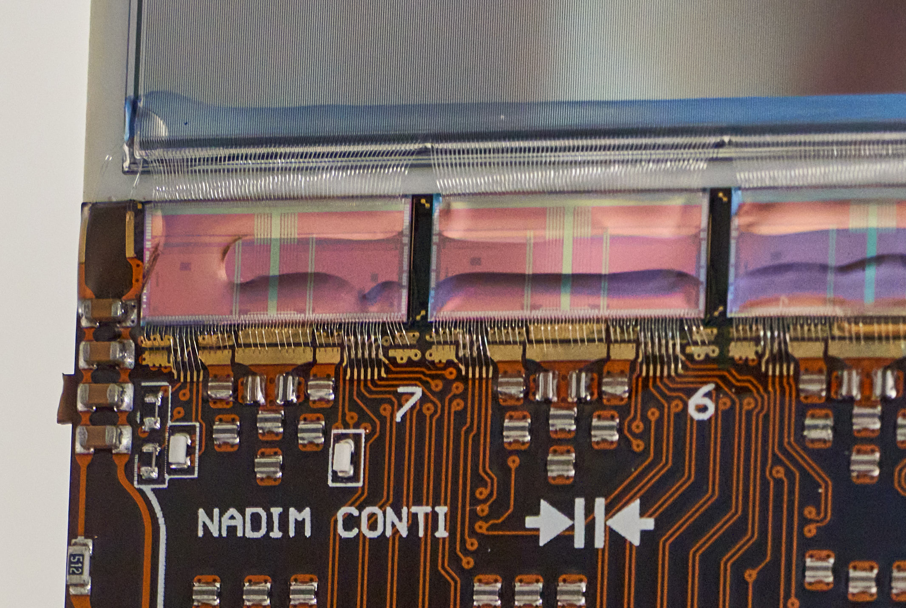
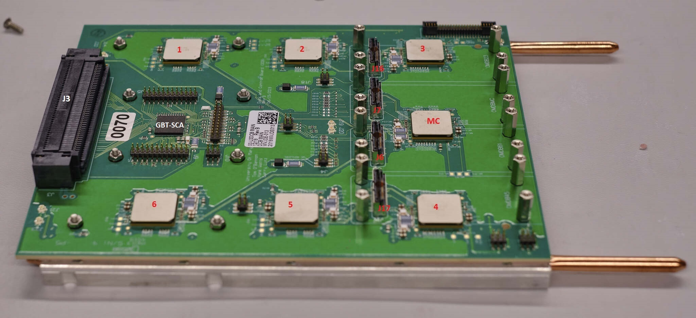
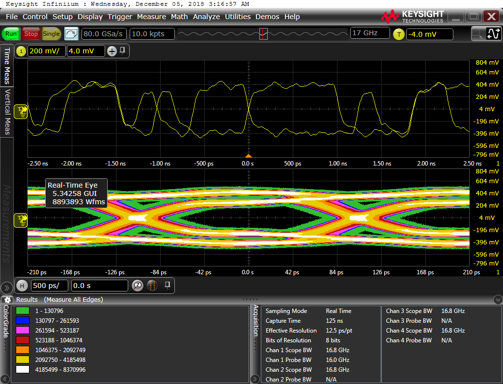
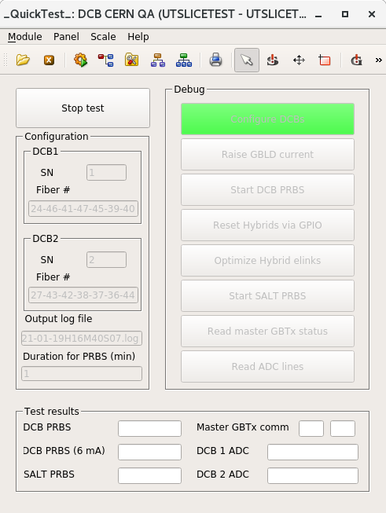
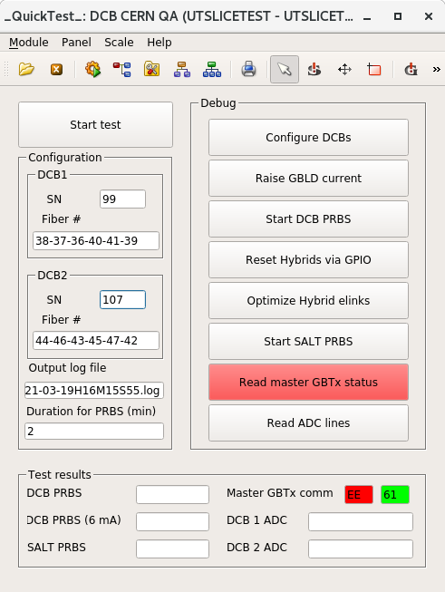

## Outline

::: columns
::: {.column width=50%}

- Preliminary measurement of \RDX
    - Introduction
    - Event selection
    - Trigger emulation for MC
    - Data/MC corrections
    - Fit
    - Systematics (WIP)

:::
::: {.column width=50%}

- Upgrade of the LHCb detector
    - Overview of the LHCb upgrade
    - The Upstream Tracker

:::
:::

<!-- combine online + trigger, remove large description, remove hlt1 show -->

## Introduction

::: columns
::: {.column width=50%}

- Preliminary measurement of \RDX
    - **Introduction**
    \color{gray}
    - Event selection
    - Trigger emulation for MC
    - Data/MC corrections
    - Fit
    - Systematics (WIP)

:::
::: {.column width=50%}

- Upgrade of the LHCb detector
    - \color{gray}Overview of the LHCb upgrade
    - The Upstream Tracker

:::
:::

## The standard model and beyond

::: columns
::: {.column width=65%}

- The standard model (SM) is a **hugely successful** theory
    - A QFT describing **interactions** between **fermions & bosons**
    - Allow **arbitrary identical copies of leptons** (except for interactions w/ Higgs)
      $\rightarrow$ **lepton flavor universality (LFU)**
    - **3 generations of leptons**: $e, \mu, \tau$

:::
::: {.column width=35%}
\centering
{ width=80% }
:::
:::

\vspace{1em}
::: columns
::: {.column width=70%}
\begin{itemize}

\tightlist
\item<2->
  SM doesn't explain every experimental observation

  \begin{itemize}
  \tightlist
  \item
    Matter-anti-matter asymmetry of the universe
  \item
    Evidence of dark matter from cosmological observations
  \item
    Demand new physics (NP) beyond the SM
  \end{itemize}
\end{itemize}

:::
::: {.column width=30%}

\visible<2->{
\vspace{0.5em}
\includegraphics[width=0.85\textwidth]{./slides-figures/darkmatter.png}
}

:::
:::

## Precision measurements & tests of LFU

\vspace{-0.5em}
\small\tightmargin
- Testing SM with **precision measurement**
    - Measure observables precisely
    - Compare with **precise theoretical predictions**
    - Deviations from SM predictions $\rightarrow$ hints to NP

\visible<2->{
\vspace{-1.5\baselineskip}
\begin{itemize}
\tightlist
\item
    LFU has been tested to high precision, \textbf{no definite violation so far}
\end{itemize}
\vspace{-\baselineskip}
}

\setlength{\leftmargini}{12pt}
\vspace{-0.5em}
::: columns
::: {.column width=50%}

\visible<2->{
\begin{block}{LFU tests with $e, \mu$}
\footnotesize
\begin{itemize}
\tightlist
\item
    To \textbf{0.28\%}: $Z$ decays
\begin{itemize}
  \tightlist
  \item
    $\frac{\Gamma_{Z \rightarrow \mu\mu}}{\Gamma_{Z \rightarrow ee}} = 1.0009 \pm 0.0028$
  \item
    LEP, \href{https://arxiv.org/abs/hep-ex/0509008}{\scriptsize\texttt{Phys. Rept. 427 (2006) 257}}
\end{itemize}

\item
    To \textbf{0.8\%}: $W$ decays
\begin{itemize}
  \tightlist
  \item
    $\frac{\mathcal{B}(W \rightarrow e \neu_e)}{\mathcal{B}(W \rightarrow \mu \neu_\mu)} = 1.004 \pm 0.008$
  \item
    CDF + LHC, \href{https://arxiv.org/abs/1809.06229}{\scriptsize\texttt{JPG: NPP, 46, 2 (2019)}}
\end{itemize}

\item
    About \textbf{9.5\%} (low-\qSq): $R_{K^{(*)}}$
\begin{itemize}
  \tightlist
  \item
    $\frac{\Gamma_{B \rightarrow K \mu\mu}}{\Gamma_{B \rightarrow K ee}} = 0.994^{+0.094}_{-0.087}$ (low-\qSq)
  \item
    LHCb, \href{https://indico.cern.ch/event/1187945/}{\scriptsize LHCb seminar (2022)}
\end{itemize}

\end{itemize}
\end{block}
}

:::
::: {.column width=50%}

\visible<2->{
\begin{block}{LFU tests with $\mu, \tau$}
\footnotesize
\begin{itemize}
\tightlist
\item
    To \textbf{0.32\%}: $Z$ decays
\begin{itemize}
  \tightlist
  \item
    $\frac{\Gamma_{Z \rightarrow \tau\tau}}{\Gamma_{Z \rightarrow \mu\mu}} = 1.0019 \pm 0.0032$
  \item
    LEP, \href{https://arxiv.org/abs/hep-ex/0509008}{\scriptsize\texttt{Phys. Rept. 427 (2006) 257}}
\end{itemize}

\item
    To \textbf{1.3\%}: $W$ decays
\begin{itemize}
  \tightlist
  \item
    $\frac{\Gamma_{W \rightarrow \tau \neu_\tau}}{\Gamma_{W \rightarrow \mu \neu_\mu}} = 0.992 \pm 0.013$
  \item
    ATLAS, \href{https://arxiv.org/abs/2007.14040}{\scriptsize\texttt{arXiv:2007.14040}}
\end{itemize}

\item
    To \textbf{6.1\%}: $D_s$ decays
\begin{itemize}
  \tightlist
  \item
    $\frac{\Gamma_{D_s \rightarrow \tau\nu_\tau}}{\Gamma_{D_s \rightarrow \mu\nu_\mu}} = 9.95 \pm 0.61$
  \item
    HFLAV, \href{https://link.springer.com/article/10.1140/epjc/s10052-017-5058-4}{\scriptsize\texttt{Eur. Phys. J. C77 (2017) 895}}
\end{itemize}

\end{itemize}
\end{block}
}

:::
:::

## Testing LFU with \RDX

\tightmargin
::: columns
::: {.column width=50%}

\small
- $\RDX \equiv \frac{\BFDTau}{\BFDMu}$
    - Advantageous over measuring BF:
      cancellation of **th. and ex. uncert.**
    - **Precise predictions (1--2%)**:
        - $\RD = 0.298 \pm 0.004$
        - $\RDst = 0.254 \pm 0.005$
    - First anomaly reported in 2012 (BaBar)
    - LHCb run 1 measurement in 2022

{ width=90% }

:::
::: {.column width=50%}

\only<2>{
\small

\begin{itemize}
\tightlist
\item \textbf{Matrix element} of $B \rightarrow D l \neul$ processes factorizable:
\end{itemize}

\vspace{-1.5\baselineskip}
\tiny
\begin{equation*}
    \mathcal{M}^{\lambda_l}_{\lambda_D}(q^2, \theta_l) =
    \frac{G_F}{\sqrt{2}} \frac{m^2_W}{m^2_W - q^2}
    \sum_{\lambda_W} \eta_{\lambda_W}
    \textcolor{Red}{L^{\lambda_l}_{\lambda_W}(q^2, \theta_l)}
    \textcolor{Green}{H^{\lambda_D}_{\lambda_W}(q^2)}
\end{equation*}
\vspace{-2\baselineskip}\small

\begin{itemize}
\tightlist
\item \textbf{\textcolor{Red}{Leptonic currents}} analytically calculable
\item \textbf{\textcolor{Green}{Hadronic currents}} involves non-perturbative QCD
      $\rightarrow$ can't calculate exactly
    \begin{itemize}
    \tightlist
    \item \textbf{Expressed as form factors (FFs), parameterized \& constrained} based on
        \tightlist
        \begin{itemize}
        \tightlist
        \vspace{-\baselineskip}
        \item Dispersion relations (first principle)
        \item Heavy Quark Effective Theory (HQET)
        \end{itemize}
    \item Numerical values of FF params obtained w/ \textbf{lattice QCD computation \& fit to data}
    \end{itemize}
\end{itemize}
}

:::
:::

## About this analysis

::: columns
::: {.column width=60%}

- This analysis: measuring \RDX w/ LHCb run 2 (2016--2018) data
    - 2016 only for now, but easy to expand
- **4+ times larger data sample in run 2**
    - **1.7x intg. lumi.** (3.1 \ifb $\rightarrow$ 5.4 \ifb)
    - **1.8x prod. xsec.** (7 TeV $\rightarrow$ 13 TeV)
    - **More efficient triggers**
    - **1.26x sig-like events for 2016 alone**
      (1,734,133 $\rightarrow$ 2,178,793)

:::
::: {.column width=40%}

:::
:::

## The Large Hadron Collider (LHC)

::: columns
::: {.column width=70%}

:::
::: {.column width=30%}

\tightmargin\small
- The LHC is a circular collider
    - Circumference: 27 km
    - Mainly colliding $pp$
    - Run 2 center of mass energy: $\sqrt{s} = 13$ TeV

:::
:::

## The LHCb detector

::: columns
::: {.column width=45%}
\vspace{0.5em}
{ width=115% }
:::
::: {.column width=55%}

:::
:::

::: columns
::: {.column width=70%}

\tightmargin
\vspace{0.5em}

- LHCb: **forward-only spectrometer** covering $1.9 < \eta < 4.9$
    - $B$ meson produced from **gluon fusion** $\rightarrow$ $B$ highly boosted
    - 4% solid angle coverage, capture ~20% of $\bbbar$
- Important for this analysis: **tracking & particle identification (PID)**
    - RICH allow separation of \kaon, \pion, $p$

:::
::: {.column width=30%}
\vspace{-4em}
{ width=120% }
:::
:::

## Event selection

::: columns
::: {.column width=50%}

- Preliminary measurement of \RDX
    - Introduction
    - **Event selection**
    \color{gray}
    - Trigger emulation for MC
    - Data/MC corrections
    - Fit
    - Systematics (WIP)

:::
::: {.column width=50%}

- Upgrade of the LHCb detector
    - \color{gray}Overview of the LHCb upgrade
    - The Upstream Tracker

:::
:::

## Signal and normalization {.fragile}

::: columns
::: {.column width=90%}
- Final visible particles (marked in \textcolor{red}{red}): \textcolor{red}{$D^{(*)}\mu$}
:::
::: {.column width=10%}
:::
:::

\centering
{ width=80% }

\visible<2>{
\begin{columns}[T]
\begin{column}{0.65\textwidth}
\begin{itemize}
\tightlist
\item
  \(\Bzb \rightarrow \Dstarp (\rightarrow \Dz (\rightarrow \textcolor{red}{\Km \pip})\textcolor{red}{\pip}) \taum (\rightarrow \textcolor{red}{\mun} \neumb \neut) \neutb)\)
\item
  \(\Bzb \rightarrow \Dstarp (\rightarrow \Dz (\rightarrow \textcolor{red}{\Km \pip})\textcolor{red}{\pip}) \textcolor{red}{\mun} \neumb\)
\vspace{0.4\baselineskip}
\item
  \(\Bm \rightarrow \Dz (\rightarrow \textcolor{red}{\Km \pip}) \taum (\rightarrow \textcolor{red}{\mun} \neumb \neut) \neutb)\)
\item
  \(\Bm \rightarrow \Dz (\rightarrow \textcolor{red}{\Km \pip}) \textcolor{red}{\mun} \neumb\)
\end{itemize}
\end{column}

\begin{column}{0.35\textwidth}
\vspace{6pt}

\RDst, sig

\RDst, norm

\vspace{0.4\baselineskip}
\RD, sig

\RD, norm
\end{column}
\end{columns}
}

\begin{tikzpicture}[relative to page]
    \node[anchor=north west,
          execute at begin node=\setlength{\baselineskip}{7pt},
          draw=PepsiBlueLt,rounded corners,
          fill=PepsiBlueLt,fill opacity=.22,text opacity=1,
        ]
        at (page cs:-0.86, 0.56) {
            \small $\RDX \equiv \frac{\BFDTau}{\BFDMu} = \frac{\text{BF(sig)}}{\text{BF(norm)}}$
        };

    \node (lineW) at (page cs:-0.95, -0.64) {};
    \node (lineE) at (page cs:0.95, -0.64) {};
    \draw<2->[ultra thick,PepsiRed] (lineW) -- (lineE);
\end{tikzpicture}

## Selection of \Dz\muon and \Dstarp\muon

::: columns
::: {.column width=50%}

\tightmargin
\setlength{\leftmargini}{12pt}
### \Dz\muon (\Dz channel)

\begin{itemize}
\item
  \Dz (\(\Km\pip\) pair)

  \begin{itemize}
  \tightlist
  \item
    High \(p_T\) signature (L0Hadron trigger)
  \item
    Invariant mass around \Dz ref. mass
  \item
    Displaced from \(pp\) vertex
  \end{itemize}
\item
  \muon

  \begin{itemize}
  \tightlist
  \item
    No trigger requirement (high \pt-bias)
  \item
    PID: add. \UBDT to further reject misID while keeping eff. flat in
    \(p_T\)
  \end{itemize}
\end{itemize}

### \Dstarp\muon (\Dstar channel)

- \Dstarp ($\Dz\pi^+_\text{slow}$ pair)
    - Same as \Dz, plus add. low-\pt $\pi^+_\text{slow}$ forming a vertex w/ \Dz

:::
::: {.column width=50%}

\vspace{1em}
\resizebox{0.8\textwidth}{!}{
\begin{tikzpicture}[
    particle/.style={draw, ->, >=stealth, thick},
    vertex/.style={draw, circle, minimum size=9pt, fill=white, inner sep=0pt},
    final ptl/.style={inner sep=1pt},
]
    \node (a0) at (0, 0) {};

    \coordinate[right=2.5em of a0] (a1);
    \coordinate[above=2em of a1] (b1);

    \node[left=2em of b1, gray, final ptl] (d1) {\tiny $\overline\nu_\tau$};
    \coordinate[above right=1.5em and 1.5em of b1] (d2);
    \coordinate[below right=0.5em and 2.5em of b1] (d3);

    \node[above left=0.5em and 1em of d2, gray, final ptl] (e1) {\tiny $\overline\nu_\mu$};
    \node[above right=0.7em and 0.4em of d2, gray, final ptl] (e2) {\tiny $\nu_\tau$};
    \node[above right=0.1em and 2.3em of d2, red, final ptl] (e3) {\tiny $\mu^-$};

    \node[above right=0.4em and 1.4em of d3, red, final ptl] (f1) {\tiny $K^-$};
    \node[below right=1.2em and 0.6em of d3, red, final ptl] (f2) {\tiny $\pi^+$};

    \node[below right=1.5em and 0.8em of b1, orange, final ptl] (g1) {\tiny $\pi^+_\text{slow}$};

    \draw[particle, dashed] (a0) -- (b1);

    \draw[particle, gray] (b1) -- (d1);
    \draw[particle, dashed] (b1) -- (d2);
    \draw[particle, dashed] (b1) -- (d3);

    \draw[particle, gray] (d2) -- (e1);
    \draw[particle, gray] (d2) -- (e2);
    \draw[particle, red] (d2) -- (e3);

    \draw[particle, red] (d3) -- (f1);
    \draw[particle, red] (d3) -- (f2);

    \draw[particle, orange] (b1) -- (g1);

    \node[vertex] (x0) at (a0) {\tiny $pp$};
    \node[vertex] (x1) at (b1) {\tiny $B$};
    \node[vertex] (x2) at (d3) {\tiny \Dz};
    \node[vertex, gray, fill=white] (x3) at (d2) {\tiny $\tau$};
\end{tikzpicture}
}

\vspace{0.5em}

\resizebox{0.8\textwidth}{!}{
\begin{tikzpicture}[
    particle/.style={draw, ->, >=stealth, thick},
    vertex/.style={draw, circle, minimum size=9pt, fill=white, inner sep=0pt},
    final ptl/.style={inner sep=1pt},
]
    \node (a0) at (0, 0) {};

    \coordinate[right=2.5em of a0] (a1);
    \coordinate[above=2em of a1] (b1);

    \node[left=2em of b1, gray, final ptl] (d1) {\tiny $\overline\nu_\mu$};
    \node[above right=1.5em and 1.5em of b1, final ptl, red] (d2) {\tiny $\mu^-$};
    \coordinate[below right=0.5em and 2.5em of b1] (d3);

    \node[above right=0.4em and 1.4em of d3, red, final ptl] (f1) {\tiny $K^-$};
    \node[below right=1.2em and 0.6em of d3, red, final ptl] (f2) {\tiny $\pi^+$};

    \node[below right=1.5em and 0.8em of b1, orange, final ptl] (g1) {\tiny $\pi^+_\text{slow}$};

    \draw[particle, dashed] (a0) -- (b1);

    \draw[particle, gray] (b1) -- (d1);
    \draw[particle, red] (b1) -- (d2);
    \draw[particle, dashed] (b1) -- (d3);

    \draw[particle, red] (d3) -- (f1);
    \draw[particle, red] (d3) -- (f2);

    \draw[particle, orange] (b1) -- (g1);

    \node[vertex] (x0) at (a0) {\tiny $pp$};
    \node[vertex] (x1) at (b1) {\tiny $B$};
    \node[vertex] (x2) at (d3) {\tiny \Dz};
\end{tikzpicture}
}

:::
:::

\begin{tikzpicture}[relative to page]
    \node[anchor=north west,
          draw=PepsiBlueLt,rounded corners,
          fill=PepsiBlueLt,fill opacity=.22,text opacity=1,
          text width=3em, align=center
        ]
        at (page cs:0.75, 0.4) {
            \footnotesize sig
        };

    \node[anchor=north west,
          draw=PepsiBlueLt,rounded corners,
          fill=PepsiBlueLt,fill opacity=.22,text opacity=1,
          text width=3em, align=center
        ]
        at (page cs:0.75, -0.3) {
            \footnotesize norm
        };

    \node[anchor=north,
          draw=PepsiBlueLt,rounded corners,
          fill=PepsiBlueLt,fill opacity=.22,text opacity=1,
        ]
        at (page cs:0.49, -0.74) {
            \footnotesize \muon from sig decays are softer than \muon from norm
        };
\end{tikzpicture}

## \UBDT

::: columns
::: {.column width=50%}

\centering
{ width=90% }

:::
::: {.column width=50%}

\centering
{ width=90% }

:::
:::

- More efficient at rejecting \pion (**main source of misID**)
- Efficiency flat in \pt: **sig & norm have similar selection eff.**
  $\rightarrow$ **no bias** in selection & easier to model
- Remaining misID effect (non-\muon misID'ed as \muon) modeled w/ a data ctrl sample

## Feed down from \Dstarp\muon and \Dstarz\muon

\small

::: columns
::: {.column width=60%}

### \Dstarp\muon: $\Bzb \rightarrow \Dstarp (\rightarrow \Dz\pip) l^- \neulb$

- Not all slow \pip from \Dstarp decays are reco'ed
    - **Some** \Dstarp\muon feed down into \Dz\muon

::: {.block}
### \Dstarz\muon: $\Bm \rightarrow \Dstarz (\rightarrow \Dz\piz) l^- \neulb$
- Neutral slow $\piz$ **entirely missed**
    - **All** \Dstarz\muon feed down into \Dz\muon
    - **~2.5x BF** compared to $B \rightarrow \Dz$
:::

:::
::: {.column width=40%}

- $p = 8$ GeV for a typical $\pi_\text{slow}$
- Fail to reco. ~35% of the time

\centering
{ width=100% }

:::
:::

\vspace{0.5em}
::: columns
::: {.column width=90%}

- Feed down makes \RD and $\RDst$ **correlated**
    - **Simultaneous fit** needed
    - **Improve precision** for \RDst
      due to large \Dstarz\muon feed down sample
<!-- - To avoid double-counting, veto \Dstarp\muon in \Dz\muon -->

:::
::: {.column width=10%}

:::
:::

## Background contributions

\tightmargin
::: columns
::: {.column width=50%}

\begin{itemize}
\tightlist
\item
  \textbf{Partially reco'ed bkgs} (final states w/ \DXmu + more)

  \begin{itemize}
  \item
    Four \(1P\) \Dstst

    \begin{itemize}
    \tightlist
    \item
      \(B \rightarrow \Dstst (\rightarrow D^{0|*|**} (\rightarrow D^{0|*}\pi) \pi) l\neul\)
    \end{itemize}
  \item<2->
    Highly excited \Dstst (\Dstst heavy, \(\Dstst_H\)):

    \begin{itemize}
    \tightlist
    \item
      \(B \rightarrow \Dstst_H (\rightarrow D^{0|*} \pi\pi) \mu\neum\)
    \end{itemize}
  \item<3->
    \DststS

    \begin{itemize}
    \tightlist
    \item
      \(B_s \rightarrow (D'_{s1}|D_{s2}) (\rightarrow D^{(*)}K) l\neul\)
    \end{itemize}
  \item<4->
    Double-charm backgrounds (\(DDX\))

    \begin{itemize}
    \tightlist
    \item
      \(B \rightarrow D^{(*)} D_q X\)
    \item
      \(D_q \rightarrow \tauon\neut\) when \(q = s\)
    \item
      \(D_q \rightarrow K \mu\neum\) when \(q = u \text{ or } d\)
    \end{itemize}
  \end{itemize}
\end{itemize}

:::
::: {.column width=50%}

\visible<5->{
\begin{itemize}
\tightlist
\item
  \textbf{Mis-reconstructions}

  \begin{itemize}
  \tightlist
  \item
    MisID

    \begin{itemize}
    \tightlist
    \item
      ``\muon'' in the \DXmu pair is \textbf{not} a \muon
    \end{itemize}
  \item
    Combinatorial bkgs

    \begin{itemize}
    \tightlist
    \item
      Random combinations of \Dz\muon, \Dstarp\muon, or \Dz\pion
      \textbf{not} from the same \(B\)
    \end{itemize}
  \end{itemize}
\end{itemize}
}

\vspace{3em}

\centering

:::
:::

\begin{tikzpicture}[relative to page]
    \node<4->[anchor=north,
          draw=PepsiBlueLt,rounded corners,
          fill=PepsiBlueLt,fill opacity=.22,text opacity=1,
          text width=12em, align=center,
        ]
        at (page cs:-0.5, -0.54) {
            \footnotesize\bfseries Modeled w/ MC, w/ shape corrections from ctrl samples
        };
    \node<5->[anchor=north,
          draw=PepsiBlueLt,rounded corners,
          fill=PepsiBlueLt,fill opacity=.22,text opacity=1,
        ]
        at (page cs:0.5, 0.09) {
            \footnotesize\bfseries Modeled w/ data ctrl samples
        };

    \node[inner sep=0pt] (nw) at (page cs:0.02,-0.1) {};
    \node (se) at (page cs:0.92,-0.95) {};

    \node (pt) at (page cs:-0.1,0.36) {};

    \draw[PepsiBlueLt,ultra thick] (nw) rectangle (se);
    \draw[PepsiBlueLt,->,>=stealth,ultra thick] (nw) -- (pt);
\end{tikzpicture}

## The isolation BDT

\vspace{4em}

::: columns
::: {.column width=33%}

\resizebox{\textwidth}{!}{
\begin{tikzpicture}[
    particle/.style={draw, ->, >=stealth, thick},
    vertex/.style={draw, circle, minimum size=9pt, fill=white, inner sep=0pt},
    final ptl/.style={inner sep=1pt},
]
    \node (a0) at (0, 0) {};

    \coordinate[right=2.5em of a0] (a1);
    \coordinate[above=2em of a1] (b1);

    \node[left=2em of b1, gray, final ptl] (d1) {\tiny $\overline\nu_\mu$};
    \node[above right=1.5em and 1.5em of b1, final ptl, red] (d2) {\tiny $\mu^-$};
    \coordinate[below right=0.5em and 2.5em of b1] (d3);

    \node[above right=0.4em and 1.4em of d3, red, final ptl] (f1) {\tiny $K^-$};
    \node[below right=1.2em and 0.6em of d3, red, final ptl] (f2) {\tiny $\pi^+$};

    \node[below right=1.5em and 0.8em of b1, orange, final ptl] (g1) {\tiny $\pi^+_\text{slow}$};
    \node[above left=1.8em and 2.2em of b1, blue, final ptl] (g2) {\tiny $\pi^\pm$};

    \draw[particle, dashed] (a0) -- (b1);

    \draw[particle, gray] (b1) -- (d1);
    \draw[particle, red] (b1) -- (d2);
    \draw[particle, dashed] (b1) -- (d3);

    \draw[particle, red] (d3) -- (f1);
    \draw[particle, red] (d3) -- (f2);

    \draw[particle, orange] (b1) -- (g1);
    \draw[particle, blue, dashed] (b1) -- (g2);

    \node[vertex] (x0) at (a0) {\tiny $pp$};
    \node[vertex] (x1) at (b1) {\tiny $B/\Dstst$};
    \node[vertex] (x2) at (d3) {\tiny \Dz};
\end{tikzpicture}
}

:::
::: {.column width=33%}

:::
::: {.column width=33%}

\footnotesize
- BDT training variables:
    - PV \ipChiSq
    - SV \ipChiSq
    - track \pt
    - track opening
    - track \anyChiSq{FD}
    - track $\Delta\anyChiSq{FD}$

:::
:::

- **Further** divide selected \DXmu samples into sub-samples (**skims**)
- Reject **partially reco'ed bkgs** with **\textcolor{blue}{add. charged track(s)}**
  $\rightarrow$ **signal skim**
- Inverting the selection $\rightarrow$ **control skims** enriched in such bkgs

\begin{tikzpicture}[relative to page]
    \node[anchor=south,
          execute at begin node=\setlength{\baselineskip}{7pt},
          draw=PepsiBlueLt,rounded corners,
          fill=PepsiBlueLt,fill opacity=.22,text opacity=1,
          text width=10em
        ]
        at (page cs:0.0, 0.45) {
            \tiny
\bfseries{MVA dist. for $B \rightarrow \Dstst \mu\neum$ bkg (hatched) vs. \textcolor{magenta}{signal (solid)}}
        };

    \node[anchor=south west,
          execute at begin node=\setlength{\baselineskip}{7pt},
          draw=PepsiBlueLt,rounded corners,
          fill=PepsiBlueLt,fill opacity=.22,text opacity=1,
          text width=10em
        ]
        at (page cs:-0.9, 0.45) {
            \tiny
            \bfseries{Schematic $B \rightarrow \Dstst \mu\neum$ decay}
        };
\end{tikzpicture}

## Signal and control skims (sub-samples)

\begin{tikzpicture}[relative to page]
    % ISO
    \node (isoNW) at (page cs:-0.96,0.75) {};
    \node (isoSE) at (page cs:-0.01,-0.08) {};

    \draw[normSig,ultra thick] (isoNW) rectangle (isoSE);
    \node[anchor=north west,fill=normSig,text=white] (isoTitle) at (isoNW) {\bfseries ISO};
    \node[anchor=north west,below right=1pt and -27pt of isoTitle,text width=6em] (isoText) {
        \footnotesize
        Signal-enriched.
        No charged track likely coming from the same $B$ (isolated)
    };
    \node[anchor=north east,inner sep=0pt] at (page cs:-0.03,0.73) {
        \includegraphics[width=0.33\textwidth]{./section/figs-fit-fit-results/sig-fit/stacked/fit_result-stacked-D0-iso-mmiss2.pdf}
    };

    % 2OS
    \node (2osNW) at (page cs:-0.96,-0.13) {};
    \node (2osSE) at (page cs:-0.01,-0.96) {};

    \draw[DststH,ultra thick] (2osNW) rectangle (2osSE);
    \node[anchor=north west,fill=DststH,text=black] (2osTitle) at (2osNW) {\bfseries 2OS};
    \node[anchor=north west,below right=1pt and -28pt of 2osTitle,text width=6em] (2osText) {
        \footnotesize
        Enriched in $B \rightarrow \Dstst_H \mu\neum$.
        Two anti-isolated \pion.
    };
    \node[anchor=north east,inner sep=0pt] at (page cs:-0.03,-0.15) {
        \includegraphics[width=0.33\textwidth]{./section/figs-fit-fit-results/ctrl-fit/stacked/fit_result-stacked-D0-2os-mmiss2.pdf}
    };

    % 1OS
    \node (1osNW) at (page cs:0.01,0.75) {};
    \node (1osSE) at (page cs:0.96,-0.08) {};

    \draw[Dstst,ultra thick] (1osNW) rectangle (1osSE);
    \node[anchor=north west,fill=Dstst,text=white] (1osTitle) at (1osNW) {\bfseries 1OS};
    \node[anchor=north west,below right=1pt and -27pt of 1osTitle,text width=6em] (1osText) {
        \footnotesize
        Enriched in $B \rightarrow \Dstst l\neul$.
        One extra \pion (anti-isolated).
    };
    \node[anchor=north east,inner sep=0pt] at (page cs:0.94,0.73) {
        \includegraphics[width=0.33\textwidth]{./section/figs-fit-fit-results/ctrl-fit/stacked/fit_result-stacked-D0-1os-mmiss2.pdf}
    };

    % DD
    \node (ddNW) at (page cs:0.01,-0.13) {};
    \node (ddSE) at (page cs:0.96,-0.96) {};

    \draw[DD,ultra thick] (ddNW) rectangle (ddSE);
    \node[anchor=north west,fill=DD,text=black] (ddTitle) at (ddNW) {\bfseries DD};
    \node[anchor=north west,below right=1pt and -24pt of ddTitle,text width=6em] (ddText) {
        \footnotesize
        Enriched in $B \rightarrow D^{(*)} D_q X$.
        One or more anti-isolated tracks, at least one \kaon
    };
    \node[anchor=north east,inner sep=0pt] at (page cs:0.94,-0.15) {
        \includegraphics[width=0.33\textwidth]{./section/figs-fit-fit-results/ctrl-fit/stacked/fit_result-stacked-D0-dd-mmiss2.pdf}
    };
\end{tikzpicture}

## Key kinematic variables: \mmSq, \el, \qSq

\small

- Take advantage of \mmSq, \el, \qSq to separate sig, norm, and bkgs
    - $\mmSq \equiv (p_B - p_{D^{(*)}} - p_l)^2$
    - $\el$: lepton energy in $B$ rest frame
    - $q^2 \equiv (p_B - p_{D^{(*)}})^2$

\vspace{-0.8em}
::: columns
::: {.column width=33%}

:::
::: {.column width=33%}

:::
::: {.column width=33%}

:::
:::

\vspace{2.5em}
- Not known exactly in hadron colliders ($B$ momenta not known exactly)
    - Can be approximated with rest frame approximation (RFA)

\begin{tikzpicture}[relative to page]
    \node[anchor=north west,
          draw=PepsiBlueLt,rounded corners,
          fill=PepsiBlueLt,fill opacity=.22,text opacity=1
        ]
        at (page cs:0.02, 0.575) {These are fit variables!};

    \node[anchor=north west,
          draw=PepsiBlueLt,rounded corners,
          fill=PepsiBlueLt,fill opacity=.22,text opacity=1
        ]
        at (page cs:-0.515, 0.30) {\footnotesize \mmSq};

    \node[anchor=north west,
          draw=PepsiBlueLt,rounded corners,
          fill=PepsiBlueLt,fill opacity=.22,text opacity=1
        ]
        at (page cs:0.175, 0.30) {\footnotesize \el};

    \node[anchor=north west,
          draw=PepsiBlueLt,rounded corners,
          fill=PepsiBlueLt,fill opacity=.22,text opacity=1
        ]
        at (page cs:0.41, 0.30) {\footnotesize \qSq};

    \node[anchor=north,
          draw=PepsiBlueLt,rounded corners,
          fill=PepsiBlueLt,fill opacity=.22,text opacity=1,
          text width=30em
        ]
        at (page cs:00, -0.44) {
            \footnotesize
            $\textcolor{blue}{\Bm \rightarrow \Dz\taum\neutb}$
            vs
            $\textcolor{red}{\Bm \rightarrow \Dz\mun\neumb}$
            vs
            $\textcolor{orange}{\Bzb \rightarrow \Dstarp\mun\neumb}$ feed down
            vs
            $\textcolor{gray}{\Bm \rightarrow \Dstarz\mun\neumb}$ feed down
            (RFA)
        };
\end{tikzpicture}

## Rest frame approximation

\tightmargin\vspace{-0.5em}
::: columns
::: {.column width=50%}

\small
- $e^- e^+$ collider
    - $\sqrt{s}$ at $\Upsilon(4S)$ resonance (~10.58 GeV)
    - $B$ meson production: $e^- e^+ \rightarrow \Upsilon(4S) \rightarrow B \Bbar$
    - Tag fully reco'ed $B$ meson, $B_\text{tag}$
    - $p_{B_\text{sig}} = p_{e^-} + p_{e^+} - p_{B_\text{tag}}$

\resizebox{\textwidth}{!}{
\begin{tikzpicture}[particle/.style={draw, ->, >=stealth, thick}]
    \node (a0) at (0, 0) {};
    \node[right=2.5em of a0] (a1) {$e^+$};
    \node[left=2.5em of a0] (a2) {$e^-$};

    \coordinate[above=2em of a1] (b1);
    \coordinate[below=2em of a2] (b2);

    \coordinate[below left=0.5em and 2em of b2] (c1);
    \node[below left=2em and 1em of b2, blue] (c2) {hadronic particles};
    \coordinate[below left=2em and 1em of b2] (c3);

    \node[left=2em of b1, gray] (d1) {$\overline\nu_\tau$};
    \coordinate[above right=1.5em and 1.5em of b1] (d2);
    \coordinate[below right=0.5em and 2.5em of b1] (d3);

    \node[above left=0.5em and 1em of d2, gray] (e1) {$\overline\nu_l$};
    \node[above right=0.7em and 0.4em of d2, gray] (e2) {$\nu_\tau$};
    \node[above right=0.1em and 2.3em of d2, red] (e3) {$l^-$};

    \coordinate[above right=0.2em and 1.2em of d3] (f1);
    \coordinate[below right=1em and 0.4em of d3] (f3);

    \draw [particle] (a1) -- (a0);
    \draw [particle] (a2) -- (a0);

    \draw [particle, dashed, red] (a0) -- (b1) node[midway, left, xshift=-5pt] {$B_\text{sig}$};
    \draw [particle, dashed, blue] (a0) -- (b2) node[midway, left, xshift=-5pt] {$B_\text{tag}$};

    \draw [particle, blue] (b2) -- (c1);
    \draw [particle, blue] (b2) -- (c2);
    \draw [particle, blue] (b2) -- (c3);

    \draw [particle, gray] (b1) -- (d1);
    \draw [particle, red, dashed] (b1) -- (d2) node[midway, left] {$\tau^-$};
    \draw [particle, red, dashed] (b1) -- (d3) node[midway, below] {$D^0$};

    \draw[particle, gray] (d2) -- (e1);
    \draw[particle, gray] (d2) -- (e2);
    \draw[particle, red] (d2) -- (e3);

    \draw[particle, red] (d3) -- (f1);
    \draw[particle, red] (d3) -- (f3);
\end{tikzpicture}
}

:::
::: {.column width=50%}

\small
- $pp$ collider
    - $\sqrt{s} \gg \Upsilon(4S)$ resonance (13 TeV)
    - $B$ meson production:
      $\text{partons} \rightarrow \bbbar \rightarrow B\Bbar$
        - $p_\text{partons}$ unknown
    - $B$ **vertex known to high precision**
        - **Visible** part of $B$: $m_\text{vis}$, $p_\text{vis}$
        - Angle between $B$ flight dir & $z$ axis: $\alpha$
        - Assume: proper velocity ($\gamma\beta$) the same in $z$ for $B$ and vis
          $\rightarrow$ $(p_B)_z = \frac{m_B}{m_\text{vis}}(p_\text{vis})_z$
    - RFA: $|p_B| = \frac{m_B}{m_\text{vis}} (p_\text{vis})_z \sqrt{1 + \tan^2\alpha}$

\resizebox{0.75\textwidth}{!}{
\begin{tikzpicture}[particle/.style={draw, ->, >=stealth, thick}]
    \node (a0) at (0, 0) {};
    \node[right=2.5em of a0] (a1) {$p$ ($z$ axis)};
    \node[left=2.5em of a0] (a2) {$p$};

    \coordinate[above=2em of a1] (b1);
    \coordinate[below=2em of a2] (b2);
    \coordinate[below=0.9em of b1] (b3);

    \node[left=2em of b1, gray] (d1) {$\overline\nu_\tau$};
    \coordinate[above right=1.5em and 1.5em of b1] (d2);
    \coordinate[below right=0.5em and 2.5em of b1] (d3);

    \node[above left=0.5em and 1em of d2, gray] (e1) {$\overline\nu_l$};
    \node[above right=0.7em and 0.4em of d2, gray] (e2) {$\nu_\tau$};
    \node[above right=0.1em and 2.3em of d2, red] (e3) {$l^-$};

    \coordinate[above right=0.2em and 1.2em of d3] (f1);
    \coordinate[below right=1em and 0.4em of d3] (f3);

    \draw [particle] (a1) -- (a0);
    \draw [particle] (a2) -- (a0);

    \draw [particle, orange] (a0) -- (b1) node[midway, left, xshift=-5pt] {$B$ flight dir};
    \draw [particle, red] (a0) -- (b3) node[midway, right, xshift=8pt] {visible};

    \draw [particle, gray] (b1) -- (d1);
    \draw [particle, red, dashed] (b1) -- (d2) node[midway, left] {$\tau^-$};
    \draw [particle, red, dashed] (b1) -- (d3) node[midway, above, xshift=6pt] {$D^0$};

    \draw[particle, gray] (d2) -- (e1);
    \draw[particle, gray] (d2) -- (e2);
    \draw[particle, red] (d2) -- (e3);

    \draw[particle, red] (d3) -- (f1);
    \draw[particle, red] (d3) -- (f3);

    \draw pic["\tiny$\textcolor{blue}{\alpha}$",
              draw=blue,thick,-,angle eccentricity=1.3,angle radius=18pt,
              fill=blue,fill opacity=.5,text opacity=1]
        {angle=a1--a0--b1};
\end{tikzpicture}
}

:::
:::

\begin{tikzpicture}[relative to page]
    \node[anchor=north west,
          execute at begin node=\setlength{\baselineskip}{7pt},
          draw=PepsiBlueLt,rounded corners,
          fill=PepsiBlueLt,fill opacity=.22,text opacity=1,
        ]
        at (page cs:-0.9, 0.06) {
            \scriptsize No RFA needed at $B$ factories
        };

    \node (recNW) at (page cs:-0.99, 0.78) {};
    \node (recSE) at (page cs:-0.02, -0.98) {};
    \draw<2>[fill=white,white] (recNW) rectangle (recSE);

    \node<2>[anchor=north,inner sep=0pt] at (page cs: -0.49,0.65) {
        \includegraphics[width=20em]{./slides-figures/rfa_resolution.pdf}
    };

    \node<2>[anchor=north,
          execute at begin node=\setlength{\baselineskip}{7pt},
          draw=PepsiBlueLt,rounded corners,
          fill=PepsiBlueLt,fill opacity=.22,text opacity=1,
          text width=18em,
        ]
        at (page cs:-0.46, -0.53) {
            \small LHCb resolution worse than $B$ factories,
            RFA resolution comparable to LHCb's
        };
\end{tikzpicture}

## Trigger emulation for MC

::: columns
::: {.column width=50%}

- Preliminary measurement of \RDX
    - Introduction
    - Event selection
    - **Trigger emulation for MC**
    \color{gray}
    - Data/MC corrections
    - Fit
    - Systematics (WIP)

:::
::: {.column width=50%}

- Upgrade of the LHCb detector
    - \color{gray}Overview of the LHCb upgrade
    - The Upstream Tracker

:::
:::

## Tracker-only MC

::: columns
::: {.column width=50%}

\tightmargin
- Leading sys. uncert. in run 1: **MC stats**
- Run 2: ~4x more data $\rightarrow$ need even more MC
    - Computationally **impractical to simulate all detector responses**
    - **~85% computation time** spent on RICH and calorimeters
      $\rightarrow$ **~8x faster** turning them off
    - Requested ~7.3B MC (run 1: ~1B), w/ **~1,679M on disk** (run 1: ~65M)
        - Huge challenge logistically
- Use **Tracker-only (TO) MC** $\rightarrow$ **only tracking system turned on**
    - Triggers rely on calorimeters $\rightarrow$ **emulate trigger offline**

:::
::: {.column width=50%}
\vspace{2em}

:::
:::

\begin{tikzpicture}[relative to page]
    \node[anchor=north,
          draw=PepsiBlueLt,rounded corners,
          fill=PepsiBlueLt,fill opacity=.22,text opacity=1,
        ]
        at (page cs:0.46, 0.7) {
            \tiny \RDX run 1 analysis uncertainty table
        };
\end{tikzpicture}

## Emulate L0

::: columns
::: {.column width=50%}

:::
::: {.column width=50%}

:::
:::

\tightmargin
::: columns
::: {.column width=50%}

\small
- L0Hadron TOS
    - Trained a BDT (\xgboost) to predict the trigger probabilistically
    - Based on tracker estimated $E_T$, calo-hitting projections & more

:::
::: {.column width=50%}

\small
- L0Global TIS
    - Measured in data ($B \rightarrow \jpsi K$) b.c. L0Global TIS portable across reco modes,
      applied as a weight

:::
:::

## Emulate HLT

::: columns
::: {.column width=50%}

:::
::: {.column width=50%}

:::
:::

\tightmargin
::: columns
::: {.column width=50%}

\small
- `Hlt1TrackMVA`
    - Relevant vars exist in TO MC
    - ~1% constant diff after applying online/offline correction
    - Further corrected in **final reweighting**

:::
::: {.column width=50%}

\small
- `Hlt1TwoTrackMVA`
    - Similarly processed as `Hlt1TrackMVA`
    - ~2.3% constant diff after online/offline correction

:::
:::

## Data/MC corrections

::: columns
::: {.column width=50%}

- Preliminary measurement of \RDX
    - Introduction
    - Event selection
    - Trigger emulation for MC
    - **Data/MC corrections**
    \color{gray}
    - Fit
    - Systematics (WIP)

:::
::: {.column width=50%}

- Upgrade of the LHCb detector
    - \color{gray}Overview of the LHCb upgrade
    - The Upstream Tracker

:::
:::

## Procedure overview

\tightmargin\small
@. Apply known corrections (**initial reweighting**)
    - **\textcolor{PepsiBlueLt}{Tracking efficiency}**
    - **\textcolor{PepsiRed}{$B$ kinematic and multiplicity}**

\vspace{11em}
@. **Update MC FF parameterizations** for \Dz, \Dstar, \Dstst
@. Perform a fit to estimate yields of sig, norm, & bkgs
@. Correct add. kinematic & geometric vars in low-\mmSq region (**final reweighting**)
    - Enriched in **norm decays** ($B \rightarrow D^{(*)}\mu\neum$)
    - Diff. in that region due to **modelling of detector effects**

\begin{tikzpicture}[relative to page]
    % Tracking
    \node (trkNW) at (page cs:-0.91,0.44) {};
    \node (trkSE) at (page cs:-0.02,-0.46) {};
    \draw[PepsiBlueLt,ultra thick] (trkNW) rectangle (trkSE) node[pos=.5] (trkCtn) {};

    \node[xshift=-2pt,yshift=-7pt] (trkFig) at (trkCtn) {
        \includegraphics[width=0.44\textwidth]{./chapter/figs-mc-correction/reweighting-tracking/tracking_eff_2016.pdf}
    };
    % Remarks
    \node[draw=PepsiBlueLt,rounded corners,
          fill=PepsiBlueLt,fill opacity=.22,text opacity=1,
        ]
        at (trkFig) {
        \tiny $\epsilon(\text{tracking, data}) / \epsilon(\text{tracking, MC})$
        };
    % Title
    \node[anchor=north west,fill=PepsiBlueLt,text=white,inner sep=3pt] (trkTitle) at (trkNW) {
        \scriptsize\bfseries Tracking efficiency
    };
    \draw[PepsiBlueLt,ultra thick] (trkNW) rectangle (trkSE);

    % B prod kinematics
    \node (prodNW) at (page cs:0.02,0.44) {};
    \node (prodSE) at (page cs:0.91,-0.46) {};
    \draw[PepsiRed,ultra thick] (prodNW) rectangle (prodSE) node[pos=.5] (prodCtn) {};

    % Draw bottom first so top can cover bot titles
    \node[xshift=-5.3em,yshift=-3.1em] (pPt) at (prodCtn) {
        \includegraphics[width=0.18\textwidth]{./chapter/figs-mc-correction/reweighting-JpsiK/reweight-JpsiK/b_pt.pdf}
    };
    \node[xshift=4.8em,yshift=-3.1em] (pEta) at (prodCtn) {
        \includegraphics[width=0.18\textwidth]{./chapter/figs-mc-correction/reweighting-JpsiK/reweight-JpsiK/b_eta.pdf}
    };
    % Top plots
    \node[xshift=-5.3em,yshift=2em] (pNtracks) at (prodCtn) {
        \includegraphics[width=0.18\textwidth]{./chapter/figs-mc-correction/reweighting-JpsiK/reweight-JpsiK/ntracks.pdf}
    };
    \node[xshift=4.8em,yshift=2em] (pNdof) at (prodCtn) {
        \includegraphics[width=0.18\textwidth]{./chapter/figs-mc-correction/reweighting-JpsiK/reweight-JpsiK/b_ownpv_ndof.pdf}
    };

    % Remarks
    \node[draw=PepsiRed,rounded corners,
          fill=PepsiRed,fill opacity=.22,text opacity=1,
          inner sep=1pt,xshift=1.8em
        ] at (pNtracks) {\tiny nTracks};
    \node[draw=PepsiRed,rounded corners,
          fill=PepsiRed,fill opacity=.22,text opacity=1,
          inner sep=1pt,xshift=1.2em
        ] at (pNdof) {\tiny PV NDOF};
    \node[draw=PepsiRed,rounded corners,
          fill=PepsiRed,fill opacity=.22,text opacity=1,
          inner sep=1pt,xshift=1.6em
        ] at (pPt) {\tiny $B$ \pt};
    \node[draw=PepsiRed,rounded corners,
          fill=PepsiRed,fill opacity=.22,text opacity=1,
          inner sep=1pt,xshift=2.1em
        ] at (pEta) {\tiny $B$ $\eta$};
    % Title
    \node[anchor=north west,fill=PepsiRed,text=white,inner sep=3pt] (trkTitle) at (prodNW) {
        \scriptsize\bfseries $B$ kinematics and multiplicity
    };
    \draw[PepsiRed,ultra thick] (prodNW) rectangle (prodSE);
\end{tikzpicture}

<!-- A two-track vertex has one degree of freedom. A three-track vertex has three degrees of freedom.  -->
<!-- This looks like a covariance matrix problem! -->

## Form factor reweighting

\small\vspace{-1.2em}
- Change FF parameterization $\xleftrightarrow{\text{\bfseries equivalent}}$ reweighting
    - FF parameterization **determines** differential decay rate
      $d\Gamma / d\PSpt$
    - For each MC event, weight $w$ given by:
      \vspace{-0.4\baselineskip}
      $$
      \scriptsize
      w = \left.
              \frac{d\Gamma_\text{target} / d\PSpt}{d\Gamma_\text{source} / d\PSpt}
          \right|_\text{eval at phase space point}
      $$
      \vspace{-1.1\baselineskip}
- **BGL & BLR more flexible** $\rightarrow$ **derive shape corrections in fit**
\vspace{-0.8\baselineskip}

::: columns
::: {.column width=33%}

:::
::: {.column width=33%}

:::
::: {.column width=33%}

:::
:::

\begin{tikzpicture}[relative to page]
    \node[anchor=north,
          draw=PepsiBlueLt,rounded corners,
          fill=PepsiBlueLt,fill opacity=.22,text opacity=1,
          inner sep=2pt
        ]
        at (page cs:-0.69, -0.46) {
            \tiny $\Bm \rightarrow \Dz\mun\neumb$
        };

    \node[anchor=north,
          draw=PepsiBlueLt,rounded corners,
          fill=PepsiBlueLt,fill opacity=.22,text opacity=1,
        ]
        at (page cs:-0.62, -0.78) {
            \footnotesize $B \rightarrow \Dz$ (CLN $\rightarrow$ \textcolor{red}{BGL})
        };

    \node[anchor=north,
          draw=PepsiBlueLt,rounded corners,
          fill=PepsiBlueLt,fill opacity=.22,text opacity=1,
          inner sep=2pt
        ]
        at (page cs:0.02, -0.26) {
            \tiny $\Bzb \rightarrow \Dstarp\mun\neumb$
        };

    \node[anchor=north,
          draw=PepsiBlueLt,rounded corners,
          fill=PepsiBlueLt,fill opacity=.22,text opacity=1,
        ]
        at (page cs:0.02, -0.78) {
            \footnotesize $B \rightarrow \Dstar$ (CLN $\rightarrow$ \textcolor{red}{BGL})
        };

    \node[anchor=north,
          draw=PepsiBlueLt,rounded corners,
          fill=PepsiBlueLt,fill opacity=.22,text opacity=1,
          inner sep=2pt
        ]
        at (page cs:0.78, -0.26) {
            \tiny $\Bzb \rightarrow D^{*+}_2\mun\neumb$
        };

    \node[anchor=north,
          draw=PepsiBlueLt,rounded corners,
          fill=PepsiBlueLt,fill opacity=.22,text opacity=1,
        ]
        at (page cs:0.68, -0.78) {
            \footnotesize $B \rightarrow \Dstst$ (ISGW2 $\rightarrow$ \textcolor{red}{BLR})
        };
\end{tikzpicture}

## Final reweighting

\begin{tikzpicture}[relative to page]
    \node[anchor=north,
          execute at begin node=\setlength{\baselineskip}{7pt},
          draw=PepsiBlueLt,rounded corners,
          fill=PepsiBlueLt,fill opacity=.22,text opacity=1,
          inner sep=2pt
        ]
        at (page cs:0.34, 0.72) {
            \scriptsize Multi-stage final reweighting vars
        };

    \node[anchor=north,
          execute at begin node=\setlength{\baselineskip}{7pt},
          draw=Red,rounded corners,
          fill=Red,fill opacity=.22,text opacity=1,
          inner sep=2pt
        ]
        at (page cs:-0.015, -0.77) {\scalebox{.55}{S1: $\Dz \sqrt{IP \chi^2}/IP)$}};

    \node[anchor=north,
          execute at begin node=\setlength{\baselineskip}{7pt},
          draw=Blue,rounded corners,
          fill=Blue,fill opacity=.22,text opacity=1,
          inner sep=2pt
        ]
        at (page cs:0.36, -0.77) {\scalebox{.55}{S2: $\Dz\muon \log(FD \chi^2)$}};

    \node[anchor=north,
          execute at begin node=\setlength{\baselineskip}{7pt},
          draw=Green,rounded corners,
          fill=Green,fill opacity=.22,text opacity=1,
          inner sep=2pt
        ]
        at (page cs:0.745, -0.77) {\scalebox{.55}{S10: $\Dz \log(1-DIRA)$}};

    % picture in the left
    \node[anchor=north west,inner sep=0pt]
        at (page cs:-1.0, 0.79) {
            \includegraphics[width=15em]{./slides-figures/schematic_final_rwt.pdf}
        };
\end{tikzpicture}

\vspace{-2.5em}\tightmargin
::: columns
::: {.column width=35%}

\vspace{10em}\small
- Perform an initial fit to estimate yields
- Reweight low \mmSq region of sig (ISO) fit
    - Enriched in **norm**
- After final reweighting, consider **MC describe data sufficiently well**

:::
::: {.column width=65%}

\vspace{2.1em}
\resizebox{\textwidth}{!}{
    \begin{tabular}{c|l|c|l|c|l}
        \toprule
         {\bf Variable 1}             & {\bf Binning 1}   & {\bf Variable 2}               & {\bf Binning 2}   & {\bf Variable 3}                     & {\bf Binning 3}   \\
        \midrule
         $K$ $\sqrt{IP\, \chi^2} / IP$ & 10, 0 -- 100     & $\pi$ $\sqrt{IP\, \chi^2} / IP$ & 10, 0 -- 100     & \textcolor{Red}{$D^0$ $\sqrt{IP\, \chi^2} / IP$}      & 10, 15 -- 110     \\
         \textcolor{Blue}{$D^0\mu$ $\log(FD\, \chi^2)$}  & 10, 4 -- 12.5     & $D^0$ $\log(IP\, \chi^2)$      & 10, 2 -- 9       & $\mu$ $\log(IP\, \chi^2)$            & 10, 3.6 -- 11     \\
         $K$ $p_T$ [GeV]               & 10, 0 -- 11       & $K$ $\log(IP\, \chi^2)$        & 10, 3.6 -- 10.2  & $K$ $\sqrt{IP\, \chi^2} / IP$        & 10, 5 -- 100      \\
         $\pi$ $p_T$ [GeV]             & 10, 0 -- 12.5     & $\pi$ $\log(IP\, \chi^2)$      & 10, 3.6 -- 10.2  & $\pi$ $\sqrt{IP\, \chi^2} / IP$      & 10, 5 -- 100      \\
         $\mu$ $p_T$ [GeV]             & 10, 0 -- 12       & $\mu$ $\log(IP\, \chi^2)$      & 10, 3.6 -- 10.8  & $\mu$ $\sqrt{IP\, \chi^2} / IP$      & 10, 0 -- 100      \\
         $D^0$ $p_T$ [GeV]             & 10, 2 -- 18.5     & $D^0$ $\log(IP\, \chi^2)$      & 10, 2 -- 9       & $D^0$ $\sqrt{IP\, \chi^2} / IP$      & 10, 18 -- 102     \\
         $D^0$ $p_T$ [GeV]             & 20, 2 -- 18.5     & $D^0$ $\eta$                   & 10, 1.8 -- 5     & --                                   & --                \\
         $K$ $p_T$ [GeV]               & 20, 0 -- 11       & $K$ $\eta$                     & 10, 1.8 -- 5     & --                                   & --                \\
         $\pi$ $p_T$ [GeV]             & 20, 0 -- 12.5     & $\pi$ $\eta$                   & 10, 1.8 -- 5     & --                                   & --                \\
         $\mu$ $p_T$ [GeV]             & 20, 0 -- 12       & $\mu$ $\eta$                   & 10, 1.8 -- 5     & --                                   & --                \\
         \textcolor{Green}{$D^0$ $\log(1 - DIRA)$}        & 20, -14.2 -- -8.4 & --                             & --               & --                                   & --                \\
         slow $\pi$ $p_T$ [GeV]\parnote{
             This is for \Dstar channel only.
         }                            & 6, 0 -- 1.6       & slow $\pi$ $\eta$              & 10, 1.8 -- 4.8    & --                                   & --                \\
         slow $\pi$ $p_T$ [GeV]\parnoteref{parnote:final-rwt-dst}
                                      & 6, 0 -- 1.6       & slow $\pi$ $\log(IP\, \chi^2)$ & 10, -4 -- 7       & slow $\pi$ $\sqrt{IP\, \chi^2} / IP$ & 10, 0 -- 50       \\
        \bottomrule
    \end{tabular}
}

\vspace{0.5em}

{ width=32% }
{ width=32% }
{ width=32% }

:::
:::

## Fit

::: columns
::: {.column width=50%}

- Preliminary measurement of \RDX
    - Introduction
    - Event selection
    - Trigger emulation for MC
    - Data/MC corrections
    - **Fit**
    \color{gray}
    - Systematics (WIP)

:::
::: {.column width=50%}

- Upgrade of the LHCb detector
    - \color{gray}Overview of the LHCb upgrade
    - The Upstream Tracker

:::
:::

## Overall fit strategy

::: columns
::: {.column width=65%}

\tightmargin
\begin{itemize}
\tightlist
\item
  \textbf{Binned maximum likelihood fit}

  \begin{itemize}
  \tightlist
  \item
    Fit vars: \mmSq, \el, \qSq
  \item
    \textbf{Norm, sig, bkgs represented by fit templates}

    \begin{itemize}
    \tightlist
    \item
      3D histos, correlation-preserving
    \end{itemize}
  \end{itemize}
\item<2->
  Fit control skims (1OS, 2OS, DD) \textbf{first}

  \begin{itemize}
  \tightlist
  \item
    3 control skims per channel \(\rightarrow\) \textbf{simultaneous fit
    to 6 datasets}
  \item
    \textbf{Derive shape corrections for bkgs}

    \begin{itemize}
    \tightlist
    \item
      FF variations (5) \& data-driven corrections (12)
    \end{itemize}
  \end{itemize}
\item<3->
  Fit signal skim (ISO)

  \begin{itemize}
  \tightlist
  \item
    \textbf{Simultaneous fit to \Dz \& \Dstar ISO skim}
  \item
    \textbf{Load params for bkg shape corrections} as constraints or fully
    fixed

    \begin{itemize}
    \tightlist
    \item
      \textbf{They can't be determined precisely in sig fit}
    \item
      Compared to \textbf{\textcolor{Red}{nominal fit}},
      \textbf{\textcolor{Green}{fit w/ 1 add. $DDX$ param floating}} has
      smaller pulls but drives signal yield to 0
    \end{itemize}
  \end{itemize}
\end{itemize}

:::
::: {.column width=30%}

\visible<3->{
\vspace{1.1em}

\includegraphics{./chapter/figs-fit/fit_uvsd/fit_result-stacked-Dst-iso-q2.pdf}

\includegraphics{./chapter/figs-fit/fit_uvsd/fit_result-stacked-Dst-iso-q2-floating_uvsd.pdf}
}

:::
:::

\begin{tikzpicture}[relative to page]
    \node<3->[anchor=north,
          draw=Red,rounded corners,
          fill=Red,fill opacity=.22,text opacity=1,
          inner sep=2pt
        ]
        at (page cs:0.66, 0.72) {\tiny Nominal fit for \Dstar ISO};

    \node<3->[anchor=north,
          execute at begin node=\setlength{\baselineskip}{6pt},
          draw=Green,rounded corners,
          fill=Green,fill opacity=.22,text opacity=1,
          inner sep=2pt,
          text width=8em, align=center
        ]
        at (page cs:0.66, -0.79) {\tiny \Dstar ISO fit w/ 1 $DDX$ shape param floating};
\end{tikzpicture}

## Templates in the fit

\begin{tikzpicture}[relative to page]
    % main figure
    \node[anchor=north west,inner sep=0pt] at (page cs:-1, 0.80) {
        \includegraphics[width=22em]{./slides-figures/fit_templates_schematic.pdf}};

    % block pulls
    \node (blockPullNW) at (page cs:-1,-0.152) {};
    \node (blockPullSE) at (page cs:1,-1) {};
    \draw[fill=white,white] (blockPullNW) rectangle (blockPullSE);

    % block '5' (the remaining tick label)
    \node (block5NW) at (page cs: -1,-0.1) {};
    \node (block5SE) at (page cs: -0.84,-1) {};
    \draw[fill=white,white] (block5NW) rectangle (block5SE);

    % erase title
    \node[anchor=north,inner sep=0pt,fill=white,white,text width=8em,align=center] at (page cs:-0.39,0.781) {
        \scriptsize \Dz, DD, \el
    };

    \node[anchor=north,inner sep=3pt,rounded corners,
          draw=gray,fill=gray,fill opacity=.22,text opacity=1] at (page cs:-0.4,0.6) {
        \footnotesize \Dz, DD, \el
    };

    \node[anchor=north west] at (page cs: 0.1,0.75) {
        \scriptsize
        \begin{tabular}{l|c|c}
            & \Dz & \Dstar \\
            \midrule
            \colorbox{Ds}{\phantom{XXX}} \DststS & 2 subtypes & 2 subtypes \\
            \colorbox{DD}{\phantom{XXX}} $DDX$ & 4 & 4 \\
            \colorbox{DststH}{\phantom{XXX}} $\Dstst_H$ & 3 & 1 \\
            \colorbox{Dstst}{\phantom{XXX}} \Dstst & 20 & 12 \\
            \colorbox{normSig}{\phantom{XXX}} norm + sig & 6 & 2 \\
            \colorbox{combBkg}{\phantom{XXX}} comb bkg & 1 & 2 \\
            \colorbox{misID}{\phantom{XXX}} misID & 1 & 1 \\
            \midrule
            \colorbox{white}{\phantom{XXX}} Total & 37 & 24 \\
        \end{tabular}
    };
\end{tikzpicture}

\vspace{9em}
::: columns
::: {.column width=33%}
\centering
\vspace{4pt}

:::
::: {.column width=33%}
\vspace{3pt}

:::
::: {.column width=33%}
\vspace{2pt}

:::
:::

\begin{tikzpicture}[relative to page]
    % misID
    \node (misIDNW) at (page cs:-0.95,-0.19) {};
    \node (misIDSE) at (page cs:-0.32,-0.95) {};
    \draw[misID,ultra thick] (misIDNW) rectangle (misIDSE);

    \node[execute at begin node=\setlength{\baselineskip}{7pt},
          anchor=north,inner sep=1pt,draw=misID,fill=misID,fill opacity=.4,text opacity=1,
          rounded corners,text width=7em] at (page cs:-0.55,-0.23) {
        \tiny misID: iterative unfolding \\
        \colorbox{normSig}{\phantom{XX}} \pion
        \colorbox{Dstst}{\phantom{XX}} ghost
    };

    % comb bkg
    % block plot title
    \node (combNW) at (page cs:-0.29,-0.19) {};
    \node (combSE) at (page cs:0.95,-0.215) {};
    \draw[fill=white,white] (combNW) rectangle (combSE);

    \node (combNW) at (page cs:-0.29,-0.19) {};
    \node (combSE) at (page cs:0.95,-0.95) {};
    \draw[combBkg,ultra thick] (combNW) rectangle (combSE);

    % BComb
    \node[execute at begin node=\setlength{\baselineskip}{7pt},
          anchor=north,inner sep=1pt,draw=combBkg,fill=combBkg,fill opacity=.4,text opacity=1,
          rounded corners,text width=8em] at (page cs:0.07,-0.41) {
        \tiny \DXmu comb: lin. rescale fac. (fit to $m_B$ USB)
    };

    % Dst comb
    \node[execute at begin node=\setlength{\baselineskip}{7pt},
          anchor=north,inner sep=1pt,draw=combBkg,fill=combBkg,fill opacity=.4,text opacity=1,
          rounded corners,text width=6em] at (page cs:0.71,-0.60) {
        \tiny $\Dz\pi$ comb: rescale to fitted yield
    };
\end{tikzpicture}

## Fit model

\vspace{0.5em}
::: columns
::: {.column width=50%}

\resizebox{\textwidth}{!}{
\begin{tabular}{r|c|c|l}
\toprule
           \textbf{Alias} &                                 \textbf{Decay mode}                                  &                                                                                                                                                                                  \textbf{Normalization}                                                                                                                                                                                  & \textbf{Index}   \\
\midrule
          \texttt{D\_Dmu} &                    $B^- \rightarrow D^0 \mu^- \overline{\nu}_\mu$                    &                                                                                                                                                                                       $N_{D \mu}$                                                                                                                                                                                        & 1                \\
       \texttt{D\_dDstmu} &             $\overline{B}^0 \rightarrow D^{*+} \mu^- \overline{\nu}_\mu$             &                                                                                                                                                             $N_{D \mu} \times r_{D^*}^\text{isospin} \times r_{D^{*0}}^{0}$                                                                                                                                                              & 2                \\
       \texttt{D\_uDstmu} &                  $B^- \rightarrow D^{*0} \mu^- \overline{\nu}_\mu$                   &                                                                                                                                                                            $N_{D \mu} \times r_{D^{*0}}^{0}$                                                                                                                                                                             & 3                \\
         \texttt{D\_Dtau} &                   $B^- \rightarrow D^0 \tau^- \overline{\nu}_\tau$                   &                                                                                                                                                           $N_{D \mu} \times \textcolor{red}{\eta_{D^0}} \times \mathcal{R}(D)$                                                                                                                                                           & 4                \\
      \texttt{D\_dDsttau} &            $\overline{B}^0 \rightarrow D^{*+} \tau^- \overline{\nu}_\tau$            &                                                                                        $N_{D \mu} \times \textcolor{red}{\frac{\eta_{D^{*+}}}{\tilde{\eta}_{D^{*+}}}} \times \textcolor{red}{\tilde{\eta}_{D^{*+}}} \times \mathcal{R}(D^*) \times r_{D^{*0}}^{0} \times r_{D^*}^\text{isospin}$                                                                                         & 5                \\
      \texttt{D\_uDsttau} &                 $B^- \rightarrow D^{*0} \tau^- \overline{\nu}_\tau$                  &                                                                                                       $N_{D \mu} \times \textcolor{red}{\frac{\eta_{D^{*0}}}{\tilde{\eta}_{D^{*+}}}} \times \textcolor{red}{\tilde{\eta}_{D^{*+}}} \times \mathcal{R}(D^*) \times r_{D^{*0}}^{0}$                                                                                                        & 6                \\
        \texttt{D\_dD1mu} &               $\overline{B}^0 \rightarrow D_1 \mu \overline{\nu}_\mu$                &                                                                                      $\textcolor{blue}{\rho^\text{isospin}_{D_1}} \times \textcolor{red}{n^{0}_{D^{**}}} \times N_{D \mu} \times \textcolor{red}{f^{0}_{D_1}} \times \textcolor{red}{\epsilon_{D_1}} \times \mathcal{B}^{0}_{D_1}$                                                                                       & 7                \\
  \texttt{D\_dD1mu\_pipi} &   $\overline{B}^0 \rightarrow D_1 (\rightarrow D^0 \pi\pi) \mu \overline{\nu}_\mu$   &                                                                             $\textcolor{blue}{\rho^\text{isospin}_{D_1\pi\pi}} \times \textcolor{red}{n^{0}_{D^{**}}} \times N_{D \mu} \times \textcolor{red}{f^{0}_{D_1}} \times \textcolor{red}{\epsilon_{D_1\pi\pi}} \times \mathcal{B}^{0}_{D_1\pi\pi}$                                                                              & 8                \\
        \texttt{D\_dD2mu} &              $\overline{B}^0 \rightarrow D^*_2 \mu \overline{\nu}_\mu$               &                                                                                  $\textcolor{blue}{\rho^\text{isospin}_{D_2^*}} \times \textcolor{red}{n^{0}_{D^{**}}} \times N_{D \mu} \times \textcolor{red}{f^{0}_{D_2^*}} \times \textcolor{red}{\epsilon_{D_2^*}} \times \mathcal{B}^{0}_{D_2^*}$                                                                                   & 9                \\
       \texttt{D\_dD1pmu} &               $\overline{B}^0 \rightarrow D'_1 \mu \overline{\nu}_\mu$               &                                                                                    $\textcolor{blue}{\rho^\text{isospin}_{D'_1}} \times \textcolor{red}{n^{0}_{D^{**}}} \times N_{D \mu} \times \textcolor{red}{f^{0}_{D'_1}} \times \textcolor{red}{\epsilon_{D'_1}} \times \mathcal{B}^{0}_{D'_1}$                                                                                     & 10               \\
        \texttt{D\_dD0mu} &              $\overline{B}^0 \rightarrow D^*_0 \mu \overline{\nu}_\mu$               &                                                                                  $\textcolor{blue}{\rho^\text{isospin}_{D_1^*}} \times \textcolor{red}{n^{0}_{D^{**}}} \times N_{D \mu} \times \textcolor{red}{f^{0}_{D_1^*}} \times \textcolor{red}{\epsilon_{D_1^*}} \times \mathcal{B}^{0}_{D_1^*}$                                                                                   & 11               \\
   \texttt{D\_Dstzpipimu} & $\overline{B} \rightarrow D^{**} (\rightarrow D^{*0} \pi\pi) \mu \overline{\nu}_\mu$ &                                                                                                                                   $\textcolor{red}{n^{0}_{D^{**}}} \times N_{D \mu} \times \textcolor{red}{f_\text{guess}} \times f^0_{D^{*0}\pi\pi}$                                                                                                                                    & 12               \\
   \texttt{D\_Dstppipimu} &  $\overline{B} \rightarrow D^{**} (\rightarrow D^* \pi\pi) \mu \overline{\nu}_\mu$   &                                                                                                                                   $\textcolor{red}{n^{0}_{D^{**}}} \times N_{D \mu} \times \textcolor{red}{f_\text{guess}} \times f^0_{D^{*+}\pi\pi}$                                                                                                                                    & 13               \\
      \texttt{D\_Dpipimu} &  $\overline{B} \rightarrow D^{**} (\rightarrow D^0 \pi\pi) \mu \overline{\nu}_\mu$   &                                                                                                                                    $\textcolor{red}{n^{0}_{D^{**}}} \times N_{D \mu} \times \textcolor{red}{f_\text{guess}} \times f^0_{D^{0}\pi\pi}$                                                                                                                                    & 14               \\
        \texttt{D\_uD1mu} &                    $B^- \rightarrow D_1^0 \mu \overline{\nu}_\mu$                    &                                                                                                         $\textcolor{blue}{\rho^\text{isospin}_{D_1}} \times \textcolor{red}{n^{0}_{D^{**}}} \times N_{D \mu} \times \textcolor{red}{f^{0}_{D_1^0}} \times \mathcal{B}^{0}_{D_1}$                                                                                                         & 15               \\
  \texttt{D\_uD1mu\_pipi} &       $B^- \rightarrow D_1^0 (\rightarrow D^0 \pi\pi) \mu \overline{\nu}_\mu$        &                                                                                                   $\textcolor{blue}{\rho^\text{isospin}_{D_1\pi\pi}} \times \textcolor{red}{n^{0}_{D^{**}}} \times N_{D \mu} \times \textcolor{red}{f^{0}_{D_1^0}} \times \mathcal{B}^{0}_{D_1\pi\pi}$                                                                                                   & 16               \\
        \texttt{D\_uD2mu} &                  $B^- \rightarrow D_2^{*0} \mu \overline{\nu}_\mu$                   &                                                                                                     $\textcolor{blue}{\rho^\text{isospin}_{D_2^*}} \times \textcolor{red}{n^{0}_{D^{**}}} \times N_{D \mu} \times \textcolor{red}{f^{0}_{D_2^{*0}}} \times \mathcal{B}^{0}_{D_2^*}$                                                                                                      & 17               \\
       \texttt{D\_uD1pmu} &                  $B^- \rightarrow {D'_1}^0 \mu \overline{\nu}_\mu$                   &                                                                                                      $\textcolor{blue}{\rho^\text{isospin}_{D'_1}} \times \textcolor{red}{n^{0}_{D^{**}}} \times N_{D \mu} \times \textcolor{red}{f^{0}_{D_1^{'0}}} \times \mathcal{B}^{0}_{D'_1}$                                                                                                       & 18               \\
        \texttt{D\_uD0mu} &                  $B^- \rightarrow {D^*_0}^0 \mu \overline{\nu}_\mu$                  &                                                                                                     $\textcolor{blue}{\rho^\text{isospin}_{D_1^*}} \times \textcolor{red}{n^{0}_{D^{**}}} \times N_{D \mu} \times \textcolor{red}{f^{0}_{D_1^{*0}}} \times \mathcal{B}^{0}_{D_1^*}$                                                                                                      & 19               \\
       \texttt{D\_sDs2mu} &             $\overline{B}_s \rightarrow D_{s2}^* \mu \overline{\nu}_\mu$             &                                                                                                    $\textcolor{blue}{\mathcal{B}^{*}_{D_{s2}^{*+}}} \times \textcolor{red}{\frac{f_s}{f_d}} \times \textcolor{red}{n^{0}_{D^{**}}} \times \textcolor{red}{N^0_{s2}} \times N_{D \mu}$                                                                                                    & 20               \\
      \texttt{D\_sDs1pmu} &             $\overline{B}_s \rightarrow D'_{s1} \mu \overline{\nu}_\mu$              &                                                                                                   $\textcolor{blue}{\mathcal{B}^{*}_{D_{s1}^{'+}}} \times \textcolor{red}{\frac{f_s}{f_d}} \times N_{D \mu} \times \textcolor{red}{n^{0}_{D^{**}}} \times \textcolor{red}{N^0_{s1'}}$                                                                                                    & 21               \\
       \texttt{D\_dD1tau} &              $\overline{B}^0 \rightarrow D_1 \tau \overline{\nu}_\tau$               &          $\textcolor{blue}{\rho^\text{isospin}_{D_1}} \times \textcolor{blue}{\rho_{\mathcal{R}(D^{**})}^0} \times \textcolor{red}{n^{0}_{D^{**}}} \times N_{D \mu} \times \textcolor{red}{f^{0}_{D_1}} \times \textcolor{red}{\epsilon_{D_1}} \times \mathcal{B}^{0}_{D_1} \times \textcolor{red}{\mathcal{R}(D^{**})_\text{avg}^\text{raw}} \times \textcolor{red}{r({D_1})}$          & 22               \\
 \texttt{D\_dD1tau\_pipi} &  $\overline{B}^0 \rightarrow D_1 (\rightarrow D^0 \pi\pi) \tau \overline{\nu}_\tau$  & $\textcolor{blue}{\rho^\text{isospin}_{D_1\pi\pi}} \times \textcolor{blue}{\rho_{\mathcal{R}(D^{**})}^0} \times \textcolor{red}{n^{0}_{D^{**}}} \times N_{D \mu} \times \textcolor{red}{f^{0}_{D_1}} \times \textcolor{red}{\epsilon_{D_1\pi\pi}} \times \mathcal{B}^{0}_{D_1\pi\pi} \times \textcolor{red}{\mathcal{R}(D^{**})_\text{avg}^\text{raw}} \times \textcolor{red}{r({D_1})}$ & 23               \\
       \texttt{D\_dD2tau} &             $\overline{B}^0 \rightarrow D^*_2 \tau \overline{\nu}_\tau$              &     $\textcolor{blue}{\rho^\text{isospin}_{D_2^*}} \times \textcolor{blue}{\rho_{\mathcal{R}(D^{**})}^0} \times \textcolor{red}{n^{0}_{D^{**}}} \times N_{D \mu} \times \textcolor{red}{f^{0}_{D_2^*}} \times \textcolor{red}{\epsilon_{D_2^*}} \times \mathcal{B}^{0}_{D_2^*} \times \textcolor{red}{\mathcal{R}(D^{**})_\text{avg}^\text{raw}} \times \textcolor{red}{r({D_2^*})}$     & 24               \\
      \texttt{D\_dD1ptau} &              $\overline{B}^0 \rightarrow D'_1 \tau \overline{\nu}_\tau$              &       $\textcolor{blue}{\rho^\text{isospin}_{D'_1}} \times \textcolor{blue}{\rho_{\mathcal{R}(D^{**})}^0} \times \textcolor{red}{n^{0}_{D^{**}}} \times N_{D \mu} \times \textcolor{red}{f^{0}_{D'_1}} \times \textcolor{red}{\epsilon_{D'_1}} \times \mathcal{B}^{0}_{D'_1} \times \textcolor{red}{\mathcal{R}(D^{**})_\text{avg}^\text{raw}} \times \textcolor{red}{r({D'_1})}$        & 25               \\
       \texttt{D\_dD0tau} &             $\overline{B}^0 \rightarrow D^*_0 \tau \overline{\nu}_\tau$              &     $\textcolor{blue}{\rho^\text{isospin}_{D_1^*}} \times \textcolor{blue}{\rho_{\mathcal{R}(D^{**})}^0} \times \textcolor{red}{n^{0}_{D^{**}}} \times N_{D \mu} \times \textcolor{red}{f^{0}_{D_1^*}} \times \textcolor{red}{\epsilon_{D_1^*}} \times \mathcal{B}^{0}_{D_1^*} \times \textcolor{red}{\mathcal{R}(D^{**})_\text{avg}^\text{raw}} \times \textcolor{red}{r({D_1^*})}$     & 26               \\
       \texttt{D\_uD1tau} &                   $B^- \rightarrow D_1^0 \tau \overline{\nu}_\tau$                   &                            $\textcolor{blue}{\rho^\text{isospin}_{D_1}} \times \textcolor{blue}{\rho_{\mathcal{R}(D^{**})}^0} \times \textcolor{red}{n^{0}_{D^{**}}} \times N_{D \mu} \times \textcolor{red}{f^{0}_{D_1^0}} \times \mathcal{B}^{0}_{D_1} \times \textcolor{red}{\mathcal{R}(D^{**})_\text{avg}^\text{raw}} \times \textcolor{red}{r({D_1})}$                             & 27               \\
 \texttt{D\_uD1tau\_pipi} &       $B^- \rightarrow D_1^0 (\rightarrow D^0 \pi\pi) \mu \overline{\nu}_\tau$       &                      $\textcolor{blue}{\rho^\text{isospin}_{D_1\pi\pi}} \times \textcolor{blue}{\rho_{\mathcal{R}(D^{**})}^0} \times \textcolor{red}{n^{0}_{D^{**}}} \times N_{D \mu} \times \textcolor{red}{f^{0}_{D_1^0}} \times \mathcal{B}^{0}_{D_1\pi\pi} \times \textcolor{red}{\mathcal{R}(D^{**})_\text{avg}^\text{raw}} \times \textcolor{red}{r({D_1})}$                       & 28               \\
       \texttt{D\_uD2tau} &                 $B^- \rightarrow D_2^{*0} \tau \overline{\nu}_\tau$                  &                        $\textcolor{blue}{\rho^\text{isospin}_{D_2^*}} \times \textcolor{blue}{\rho_{\mathcal{R}(D^{**})}^0} \times \textcolor{red}{n^{0}_{D^{**}}} \times N_{D \mu} \times \textcolor{red}{f^{0}_{D_2^{*0}}} \times \mathcal{B}^{0}_{D_2^*} \times \textcolor{red}{\mathcal{R}(D^{**})_\text{avg}^\text{raw}} \times \textcolor{red}{r({D_2^*})}$                        & 29               \\
      \texttt{D\_uD1ptau} &                 $B^- \rightarrow {D'_1}^0 \tau \overline{\nu}_\tau$                  &                         $\textcolor{blue}{\rho^\text{isospin}_{D'_1}} \times \textcolor{blue}{\rho_{\mathcal{R}(D^{**})}^0} \times \textcolor{red}{n^{0}_{D^{**}}} \times N_{D \mu} \times \textcolor{red}{f^{0}_{D_1^{'0}}} \times \mathcal{B}^{0}_{D'_1} \times \textcolor{red}{\mathcal{R}(D^{**})_\text{avg}^\text{raw}} \times \textcolor{red}{r({D'_1})}$                          & 30               \\
       \texttt{D\_uD0tau} &                 $B^- \rightarrow {D^*_0}^0 \tau \overline{\nu}_\tau$                 &                        $\textcolor{blue}{\rho^\text{isospin}_{D_1^*}} \times \textcolor{blue}{\rho_{\mathcal{R}(D^{**})}^0} \times \textcolor{red}{n^{0}_{D^{**}}} \times N_{D \mu} \times \textcolor{red}{f^{0}_{D_1^{*0}}} \times \mathcal{B}^{0}_{D_1^*} \times \textcolor{red}{\mathcal{R}(D^{**})_\text{avg}^\text{raw}} \times \textcolor{red}{r({D_1^*})}$                        & 31               \\
        \texttt{D\_dDDmu} &    $\overline{B}^0 \rightarrow D^0 D_q (\rightarrow \mu \overline{\nu}_\mu X') X$    &                                                                                                                                      $\textcolor{magenta}{\rho^0_{DDX,u/d}} \times f^0_{DDX} \times N_{D \mu} \times \textcolor{red}{f^0_{DDX,d}}$                                                                                                                                       & 32               \\
        \texttt{D\_uDDmu} &         $B^- \rightarrow D^0 D_q (\rightarrow \mu \overline{\nu}_\mu X') X$          &                                                                                                                                      $\textcolor{magenta}{\rho^0_{DDX,u/d}} \times f^0_{DDX} \times N_{D \mu} \times \textcolor{red}{f^0_{DDX,u}}$                                                                                                                                       & 33               \\
       \texttt{D\_dDDtau} &   $\overline{B}^0 \rightarrow D^0 D_q (\rightarrow \tau \overline{\nu}_\tau X') X$   &                                                                                     $\textcolor{blue}{\rho^0_\text{isolation,\tau}} \times \textcolor{magenta}{\rho^0_{DDX,u/d}} \times \textcolor{red}{f^0_{DDX,\tau}} \times f^0_{DDX} \times N_{D \mu} \times \textcolor{red}{f^0_{DDX,d,\tau}}$                                                                                      & 34               \\
       \texttt{D\_uDDtau} &        $B^- \rightarrow D^0 D_q (\rightarrow \tau \overline{\nu}_\tau X') X$         &                                                                                     $\textcolor{blue}{\rho^0_\text{isolation,\tau}} \times \textcolor{magenta}{\rho^0_{DDX,u/d}} \times \textcolor{red}{f^0_{DDX,\tau}} \times f^0_{DDX} \times N_{D \mu} \times \textcolor{red}{f^0_{DDX,u,\tau}}$                                                                                      & 35               \\
         \texttt{D\_comb} &                                   $B^-$ comb. bkg.                                   &                                                                                                                                                  $\textcolor{blue}{\rho^0_\text{$B$ comb}} \times \textcolor{red}{N^0_\text{$B$ comb}}$                                                                                                                                                  & 36               \\
        \texttt{D\_misID} &                                        misID.                                        &                                                                                                                                                     $\textcolor{blue}{\rho^0_\text{misID}} \times \textcolor{red}{N^0_\text{misID}}$                                                                                                                                                     & 37               \\
\bottomrule
\end{tabular}
}

:::
::: {.column width=50%}

\tightmargin\small
- Total # of params: **Ctrl: 117**, **Sig: 63**
- MC yields **constrained relative to yields of normalization decays**
  $$
  \scriptsize
  \text{Yld MC} = \text{Yld norm} \times \text{Rel BF} \times \text{Rel sel eff}
  $$

    - Example: $\Bm \rightarrow \Dz \taum\neutb$ in \Dz channel

\vspace{-15pt}\tiny
$$
\textcolor{PepsiBlueLt}{
N_{D\mu} \times \left\{
  \RD \times \underbrace{ \BRTauToMu \times
      \frac{\epsilon{(\Bm \rightarrow \Dz \taum [\rightarrow \mun\neumb\neut] \neutb)}
      }{\epsilon({\Bm \rightarrow \Dz \mun \neumb})
  }}_{\equiv \fitRDEff} \right\}
}
$$
\vspace{-15pt}

\small
- Data-driven yields **constrained (typically Gaussian)** to expected yields derived from data ctrl samples
  $$
  \scriptsize
  \text{Yld DDrv} = \text{Gaus constraint} \times \text{Expected yld}
  $$

:::
:::

\begin{tikzpicture}[relative to page]
    \node[anchor=north,
          draw=PepsiBlueLt,rounded corners,
          fill=PepsiBlueLt,fill opacity=.22,text opacity=1,
          inner sep=3pt
        ]
        at (page cs:-0.5, 0.785) {\tiny Yield constraint scheme for \Dz ISO templates};
\end{tikzpicture}

## Shape variations: quantify lack of knowledge

\vspace{1em}
::: columns
::: {.column width=25%}

:::
::: {.column width=25%}

:::
::: {.column width=25%}

:::
::: {.column width=25%}

:::
:::

\vspace{1em}
\visible<2->{
\begin{columns}[T]
\begin{column}{0.33\textwidth}
\includegraphics{./appendix/figs-supplemental-plots/pre-ctrl-fit/stacked/fit_result-stacked-D0-2os-q2.pdf}
\end{column}

\begin{column}{0.33\textwidth}
\includegraphics{./section/figs-fit-fit-results/ctrl-fit/stacked/fit_result-stacked-D0-2os-q2.pdf}
\end{column}

\begin{column}{0.33\textwidth}
\tightmargin\small

\begin{itemize}
\tightlist
\item
  Shape variations allow us to derive \textbf{phenomenological corrections}

  \begin{itemize}
  \tightlist
  \item
    \Dz 2OS ctrl fit poor agreement to data w/o shape variations
  \item
    Fit quality mainly improved by \(\Dstst_H\) \qSq vars
  \end{itemize}
\end{itemize}
\end{column}
\end{columns}
}

\begin{tikzpicture}[relative to page]
    \node[anchor=south,
          execute at begin node=\setlength{\baselineskip}{7pt},
          draw=normSig,rounded corners,
          fill=normSig,fill opacity=.5,text opacity=1,
          inner sep=2pt, text width=8em, align=center
        ]
        at (page cs:-0.72, 0.6) {\tiny \Dz (5), \Dstar (10), \Dstst (3+2) FF vars};

    \node[anchor=south,
          execute at begin node=\setlength{\baselineskip}{7pt},
          draw=DststH,rounded corners,
          fill=DststH,fill opacity=.5,text opacity=1,
          inner sep=2pt, text width=8em, align=center
        ]
        at (page cs:-0.23, 0.6) {\tiny $\Dstst_H$ data-driven \qSq vars (3)};

    \node[anchor=south,
          execute at begin node=\setlength{\baselineskip}{7pt},
          draw=DD,rounded corners,
          fill=DD,fill opacity=.5,text opacity=1,
          inner sep=2pt, text width=8em, align=center
        ]
        at (page cs:0.25, 0.6) {\tiny $DDX$ Dalitz-inspired data-driven vars (4)};

    \node[anchor=south,
          execute at begin node=\setlength{\baselineskip}{7pt},
          draw=misID,rounded corners,
          fill=misID,fill opacity=.5,text opacity=1,
          inner sep=2pt, text width=8em, align=center
        ]
        at (page cs:0.75, 0.6) {\tiny misID decay-in-flight (1)};

    % labels
    \node[anchor=north west,
          draw=gray,rounded corners,
          fill=gray,fill opacity=.22,text opacity=1,
          inner sep=2pt,
        ]
        at (page cs:-0.91, 0.57) {\tiny \qSq};
    \node[anchor=north west,
          draw=gray,rounded corners,
          fill=gray,fill opacity=.22,text opacity=1,
          inner sep=2pt,
        ]
        at (page cs:-0.42, 0.57) {\tiny \qSq};
    \node[anchor=north west,
          draw=gray,rounded corners,
          fill=gray,fill opacity=.22,text opacity=1,
          inner sep=2pt,
        ]
        at (page cs:0.07, 0.57) {\tiny \qSq};
    \node[anchor=north east,
          draw=gray,rounded corners,
          fill=gray,fill opacity=.22,text opacity=1,
          inner sep=2pt,
        ]
        at (page cs:0.93, 0.57) {\tiny \mmSq};

    % Label for bot
    \node<2->[anchor=north west,
          draw=gray,rounded corners,
          fill=gray,fill opacity=.22,text opacity=1,
          inner sep=2pt,
        ]
        at (page cs:-0.435, -0.11) {\tiny \qSq};
    \node<2->[anchor=north west,
          draw=gray,rounded corners,
          fill=gray,fill opacity=.22,text opacity=1,
          inner sep=2pt,
        ]
        at (page cs:0.21, -0.11) {\tiny \qSq};

    % Comment on included figs
    \node[anchor=south east,
          execute at begin node=\setlength{\baselineskip}{7pt},
          draw=Dstst,rounded corners,
          fill=Dstst,fill opacity=.5,text opacity=1,
          inner sep=2pt, text width=5em, align=center
        ]
        at (page cs:-0.53, 0.115) {\tiny $B \rightarrow D_1$ FF var for BLR $\tau'$};

    \node[anchor=south east,
          execute at begin node=\setlength{\baselineskip}{7pt},
          draw=DststH,rounded corners,
          fill=DststH,fill opacity=.5,text opacity=1,
          inner sep=2pt, text width=5em, align=center
        ]
        at (page cs:-0.045, 0.115) {\tiny $B \rightarrow \Dstst_H (\rightarrow \Dz)$};
    \node[anchor=south east,
          execute at begin node=\setlength{\baselineskip}{7pt},
          draw=DD,rounded corners,
          fill=DD,fill opacity=.5,text opacity=1,
          inner sep=2pt, text width=5em, align=center
        ]
        at (page cs:0.445, 0.115) {\tiny $B \rightarrow \Dz D_q X$ lin/quad var};

    % Fit
    \node<2->[anchor=north,
          draw=gray,rounded corners,
          fill=gray,fill opacity=.22,text opacity=1,
          inner sep=2pt,
        ]
        at (page cs:-0.6, -0.82) {\tiny \Dz 2OS, no shape vars};
    \node<2->[anchor=north,
          draw=gray,rounded corners,
          fill=gray,fill opacity=.22,text opacity=1,
          inner sep=2pt,
        ]
        at (page cs:0.03, -0.82) {\tiny \Dz 2OS, w/ shape vars};
\end{tikzpicture}

## Fit result: \Dz ISO

::: columns
::: {.column width=33%}
{ width=90% }
:::
::: {.column width=33%}
{ width=90% }
:::
::: {.column width=33%}
{ width=90% }
:::
:::

\vspace{0.4em}::: columns
::: {.column width=25%}
{ width=90% }
:::
::: {.column width=25%}
{ width=90% }
:::
::: {.column width=25%}
{ width=90% }
:::
::: {.column width=25%}
{ width=90% }
:::
:::

\vspace{0.3em}::: columns
::: {.column width=25%}
{ width=90% }
:::
::: {.column width=25%}
{ width=90% }
:::
::: {.column width=25%}
{ width=90% }
:::
::: {.column width=25%}
{ width=90% }
:::
:::

\begin{tikzpicture}[relative to page]
    \node[anchor=north west,
          draw=PepsiBlueLt,rounded corners,
          fill=PepsiBlueLt,fill opacity=.22,text opacity=1,
          inner sep=2pt
        ]
        at (page cs:-0.64, 0.72) {\tiny \mmSq};
    \node[anchor=north west,
          draw=PepsiBlueLt,rounded corners,
          fill=PepsiBlueLt,fill opacity=.22,text opacity=1,
          inner sep=2pt
        ]
        at (page cs:-0.19, 0.72) {\tiny \el};
    \node[anchor=north east,
          draw=PepsiBlueLt,rounded corners,
          fill=PepsiBlueLt,fill opacity=.22,text opacity=1,
          inner sep=2pt
        ]
        at (page cs:0.85, 0.72) {\tiny \qSq};
\end{tikzpicture}

## Fit result: \Dstar ISO

::: columns
::: {.column width=33%}
{ width=90% }
:::
::: {.column width=33%}
{ width=90% }
:::
::: {.column width=33%}
{ width=90% }
:::
:::

\vspace{0.4em}::: columns
::: {.column width=25%}
{ width=90% }
:::
::: {.column width=25%}
{ width=90% }
:::
::: {.column width=25%}
{ width=90% }
:::
::: {.column width=25%}
{ width=90% }
:::
:::

\vspace{0.3em}::: columns
::: {.column width=25%}
{ width=90% }
:::
::: {.column width=25%}
{ width=90% }
:::
::: {.column width=25%}
{ width=90% }
:::
::: {.column width=25%}
{ width=90% }
:::
:::

\begin{tikzpicture}[relative to page]
    \node[anchor=north west,
          draw=PepsiBlueLt,rounded corners,
          fill=PepsiBlueLt,fill opacity=.22,text opacity=1,
          inner sep=2pt
        ]
        at (page cs:-0.64, 0.72) {\tiny \mmSq};
    \node[anchor=north west,
          draw=PepsiBlueLt,rounded corners,
          fill=PepsiBlueLt,fill opacity=.22,text opacity=1,
          inner sep=2pt
        ]
        at (page cs:-0.19, 0.72) {\tiny \el};
    \node[anchor=north east,
          draw=PepsiBlueLt,rounded corners,
          fill=PepsiBlueLt,fill opacity=.22,text opacity=1,
          inner sep=2pt
        ]
        at (page cs:0.85, 0.72) {\tiny \qSq};
\end{tikzpicture}

## Systematics (WIP)
\addcontentsline{toc}{chapter}{Systematics (WIP)}

::: columns
::: {.column width=50%}

- Preliminary measurement of \RDX
    - Introduction
    - Event selection
    - Trigger emulation for MC
    - Data/MC corrections
    - Fit
    - **Systematics (WIP)**

:::
::: {.column width=50%}

- Upgrade of the LHCb detector
    - \color{gray}Overview of the LHCb upgrade
    - The Upstream Tracker

:::
:::

## Current status of systematic studies

::: columns
::: {.column width=50%}

\vspace{0.5\baselineskip}
\resizebox{\textwidth}{!}{
\begin{tabular}{r|c|c|c}
\toprule
{\bf Source} & {\bf $\sigma_{\RDst}$ [$\times 10^{-2}$]} &
               {\bf $\sigma_{\RD}$   [$\times 10^{-2}$]} &
               {\bf Correlation} \\
\midrule
%%%%
\colorbox{yellow}{$B \rightarrow D^{(*)}\ellm\neulb$ form factors} &
0.53 (0.58) & 0.79 (2.37) & -0.71 (-0.80) \\
%%%%
\colorbox{yellow}{$B \rightarrow D^{**}\ellm\neulb$ form factors} &
0.25 (0.78) & 0.62 (1.01) & -0.85 (-0.10) \\
%%%%
Control sample shape parameters &
0.46 (0.87) & 0.96 (4.36) & TBD (-0.49) \\
%%%%
$\Lambda_b^0$ backgrounds &
TBD (0.73) & TBD (1.16) & 0.00 (0.00) \\
%%%%
$DD$ model dependence\parnoteref{parnote:ctrl-shape-params} &
TBD (0.63) & TBD (0.74) & 0.00 (0.00) \\
%%%%
\colorbox{yellow}{$B \rightarrow \Dstst\taum\neutb$ bkg} &
0.18 (0.17) & 0.49 (0.30) & -0.94 (0.78) \\
%%%%
\colorbox{yellow}{$B \rightarrow D^{(*)} \Dstst_s (\rightarrow \taum\neutb) X$ bkg} &
0.18 (0.25) & 0.62 (1.21) & -0.79 (0.59) \\
%%%%
\muon misID unfolding algorithm\parnoteref{parnote:ctrl-shape-params} &
TBD (0.74) & TBD (1.19) & 1.00 (1.00) \\
%%%%
Coulomb correction to $\mathcal{R}(\Dstarp)$ vs. $\mathcal{R}(\Dstarz)$\parnoteref{parnote:ctrl-shape-params} &
0.27 (0.17) & 0.21 (0.3) & -1.00 (-1.00) \\
%%%%
\colorbox{yellow}{\muon misID decay-in-flight correction} &
0.14 (0.06) & 0.73 (0.16) & -0.95 (0.29) \\
%%%%
Combinatorial background shape\parnoteref{parnote:ctrl-shape-params} &
TBD (0.03) & TBD (0.18) & 0.00 (0.00) \\
%%%%
Vertex resolution correction\parnoteref{parnote:ctrl-shape-params} &
TBD (0.03) & TBD (0.21) & TBD (-0.25) \\
%%%%
Data/MC corrections (add.)\parnoteref{parnote:ctrl-shape-params} &
TBD (0.40) & TBD (0.75) & 0.00 (0.00) \\
%%%%
\midrule
Data/MC corrections (mul.)\parnote{
    \label{parnote:mul}
    This is a multiplicative uncertainty.
} &
\makecell{$\text{TBD} \times \RDst$ \\ ($1.16 \times \RDst$)} &
\makecell{$\text{TBD} \times \RD$   \\ ($0.91 \times \RD$)} &
0.00 (0.00) \\
%%%%
$\mathcal{B}(\taum \rightarrow \mun\neumb\neut)$
(ext. mea.)\parnoteref{parnote:mul} &
\makecell{$0.23 \times \RDst$ \\ ($0.23 \times \RDst$)} &
\makecell{$0.23 \times \RD$   \\ ($0.23 \times \RD$)} &
1.00 (1.00) \\
\midrule
%%%%
Total systematics &
TBD (2.03) & TBD (6.16) & TBD (-0.22) \\
%%%%
MC statistical &
0.91 (1.33) & 2.62 (4.00) & -0.72 (-0.30) \\
%%%%
Statistical &
1.94 (1.88) & 6.08 (6.01) & -0.07 (-0.53) \\
\midrule
Total (sys. + stats.) &
TBD (3.07) & TBD (9.49) & TBD (-0.35) \\
\bottomrule
\end{tabular}
}

:::
::: {.column width=50%}

\tightmargin\small
- Most sys uncert included in fit as nuisances
    - General idea: perform alternative fits **w/ selected params fixed** or **different models**
        - Subtract fitted uncertainties in quadrature $\rightarrow$ systematic uncertainty
- Current status: have mechanism to eval most sys uncert
    - Problem: fit not very stable, sometimes fixing params $\rightarrow$ different minimum
        - Data stat uncert larger likely because **sys uncert underestimated**
:::
:::

\begin{tikzpicture}[relative to page]
    \node[anchor=north,
          draw=PepsiBlueLt,rounded corners,
          fill=PepsiBlueLt,fill opacity=.22,text opacity=1,
        ]
        at (page cs:-0.49, 0.73) {
            \tiny All sys uncert absolute, in $10^{-2}$; \colorbox{yellow}{uncert scale w/ data}
        };
\end{tikzpicture}

## Outlook

\tightmargin
::: columns
::: {.column width=55%}

\vspace{1em}
\small
- **Procedure to fit LHCb 2016 data developed**
- **Fully portable to 2017 & 2018 (run 2)**
    - **Perform data/MC correction separately** for each year
        - Each year has different trigger thresholds
    - Weight corrected templates by lumi & fit combined 2016--2018 data
- **All key elements** of \RDX measurement in run 2 data **developed**
    - Some work on systematic uncertainties remaining
    - Challenge to reduce systematics to level of small stat uncert

:::
::: {.column width=45%}

\centering
{ width=80% }

\small
- Stat \& sys uncert comparable, some sys scales w/ data
    - **Can use more data!**

\vspace{2.5em}

:::
:::

\begin{tikzpicture}[relative to page]
    \node[anchor=north] at (page cs:0.53, -0.60) {
            \tiny
            \begin{tabular}{r|c|c}
                & run 1 & run 2 target \\
                \midrule
                \RD    & $\pm 14\%_\text{stat} \pm 15\%_\text{sys}$   & $\pm 7\%_\text{stat} \pm 8\%_\text{sys}$ \\
                \RDst  & $\pm 6.4\%_\text{stat} \pm 8.2\%_\text{sys}$ & $\pm 3\%_\text{stat} \pm 4\%_\text{sys}$ \\
            \end{tabular}
        };
\end{tikzpicture}

## Overview of the LHCb upgrade

::: columns
::: {.column width=50%}

- Preliminary measurement of \RDX
    - Introduction
    - Event selection
    - Trigger emulation for MC
    - Data/MC corrections
    - Fit
    - Systematics (WIP)

:::
::: {.column width=50%}

- Upgrade of the LHCb detector
    - **Overview of the LHCb upgrade**
    - \color{gray} The Upstream Tracker

:::
:::

## LHCb readout bottleneck in run 1 & 2

::: columns
::: {.column width=50%}

\tightmargin\small\vspace{0.5em}
- LHCb doesn't utilize LHC's peak luminosity
    - CMS: $1.5 \times 10^{34}$ \lumiInsta
    - LHCb: $4 \times 10^{32}$ \lumiInsta, **~1/40 of CMS**
        - Lumi levelling by de-focusing beams

- **Main bottleneck: detector readout rate at 1 MHz**
    - LHC bunch-crossing rate: 40 MHz, collision rate: ~30 MHz
- Hardware triggers (cut on \pt, $E_T$) to
  **keep readout rate constant**
    - **Higher lumi** $\rightarrow$ **harder cuts**
    - **Hadronic triggers saturate, no benefit from increase in lumi**
    - **Run 2 int. lumi**: ~2 \ifb/year

:::
::: {.column width=50%}

\centering
{ width=70% }

\begin{itemize}
\tightlist\small
\item<2->
  \textbf{Solution: readout at 40 MHz so hardware triggers can be
  removed}

  \begin{itemize}
  \tightlist
  \item
    \textbf{LHCb run 3 lumi}: \(2 \times 10^{33}\) \lumiInsta
  \item
    \textbf{First (hardware) triggers-less detector in a hadron
    collider}
  \end{itemize}
\end{itemize}

:::
:::

## The LHCb detector in run 3

::: columns
::: {.column width=60%}

\begin{onlyenv}<1-2>
\vspace{2em}
\includegraphics<1>[width=\textwidth]{./chapter/figs-detector/lhcb_detector_view.pdf}
\includegraphics<2>[width=\textwidth]{./chapter/figs-lhcb-upgrade-overview/lhcb_detector_view_run3.pdf}

\begin{tikzpicture}[relative to page]
    \node<1>[anchor=north,
          draw=PepsiBlueLt,rounded corners,
          fill=PepsiBlueLt,fill opacity=.22,text opacity=1,
        ]
        at (page cs:-0.5, 0.65) {\small run 1--2\vphantom{3}};

    \node<2>[anchor=north,
          draw=PepsiBlueLt,rounded corners,
          fill=PepsiBlueLt,fill opacity=.22,text opacity=1,
        ]
        at (page cs:-0.5, 0.65) {\small run 3\vphantom{12}};
\end{tikzpicture}
\end{onlyenv}

:::
::: {.column width=40%}

\tightmargin\small
- **Full detector readout rate upgraded to 40 MHz**
- **New tracking system: better resolution & more radiation tolerant**
    - VELO $\rightarrow$ Pixelated VELO
    - TT $\rightarrow$ **UT**
        - **Major contrib. from Maryland**
    - T-stations $\rightarrow$ SciFi
- Reduce RICH occupancy: maintain good PID w/ higher lumi
- Remove M1, PS & SPD (used for HW trigger): less material before ECAL
  $\rightarrow$ better $E$ resolution

:::
:::

## Concept arts of the upgraded tracking system

\centering
\begin{figure}[H]
    \centering
    \begin{subfigure}[t]{0.6\textwidth}
        \centering
        \includegraphics[width=\textwidth]{./chapter/figs-lhcb-upgrade-overview/tracking/velo_upgrade.pdf}
    \end{subfigure}

    %%%%
    \begin{subfigure}[t]{0.35\textwidth}
        \centering
        \includegraphics[width=\textwidth]{./chapter/figs-lhcb-upgrade-overview/tracking/ut_upgrade.pdf}
    \end{subfigure}
    \hspace{3em}
    \begin{subfigure}[t]{0.35\textwidth}
        \centering
        \includegraphics[width=\textwidth]{./chapter/figs-lhcb-upgrade-overview/tracking/scifi_upgrade.pdf}
    \end{subfigure}
\end{figure}

\begin{tikzpicture}[relative to page]
    \node[anchor=west,
          draw=PepsiBlueLt,rounded corners,
          fill=PepsiBlueLt,fill opacity=.22,text opacity=1,
        ]
        at (page cs:0.58, 0.42) {\small Pixelated VELO};

    \node[anchor=north east,
          draw=PepsiBlueLt,rounded corners,
          fill=PepsiBlueLt,fill opacity=.22,text opacity=1,
        ]
        at (page cs:-0.75, -0.5) {\small UT};

    \node[anchor=north west,
          draw=PepsiBlueLt,rounded corners,
          fill=PepsiBlueLt,fill opacity=.22,text opacity=1,
        ]
        at (page cs:0.75, -0.5) {\small SciFi};
\end{tikzpicture}

## The upgraded trigger scheme

\tightmargin
::: columns
::: {.column width=50%}

{ height=12em }
{ height=12em }

:::
::: {.column width=50%}

\small
- Upgraded LHCb removes HW trigger
- High-level SW triggers: HLT1 & HLT2
- HLT1 w/ event builder (resp. for collecting data from detector)
    - Each event builder hosts **2 GPUs for HLT1**
        - Ideally suited for track reco
        - **30x** reduction in inter-communication **bandwidth**

:::
:::

## The Upstream Tracker

::: columns
::: {.column width=50%}

- Preliminary measurement of \RDX
    - Introduction
    - Event selection
    - Trigger emulation for MC
    - Data/MC corrections
    - Fit
    - Systematics (WIP)

:::
::: {.column width=50%}

- Upgrade of the LHCb detector
    - Overview of the LHCb upgrade
    - **The Upstream Tracker**

:::
:::

## Overview of the Upstream Tracker

::: columns
::: {.column width=60%}

{ width=15% }
{ width=32% }
\hspace{0.5em}
{ width=45% }
<!-- { width=45% } -->

:::
::: {.column width=40%}

\tightmargin\small
- UT: a silicon-strip detector
    - 4 detection layers, $x$-$u$-$v$-$x$ configuration
    - Better resolution near beam pipe
    - Closer to beam pipe (circular cutout)

- Detector box
    - Staves
        - Sensors & SALT readout ASIC
- PEPI
    - Backplane (BP)
    - DCB
- Service Bay
    - LVR

:::
:::

\begin{tikzpicture}[relative to page]
    \node[anchor=north west,inner sep=0pt]
        at (page cs:0.78, 0.75) {
            \includegraphics[width=0.11\textwidth]{./slides-figures/xuvx_schematic.pdf}
        };

    \node[anchor=north west,inner sep=0pt]
        at (page cs:0.54, -0.426) {
            \includegraphics[width=0.23\textwidth]{./chapter/figs-ut-upgrade/stave/stave_hybrid_closeup.jpg}
        };

    \node[anchor=north,
          draw=Green,rounded corners,inner sep=2pt,
          fill=Green,fill opacity=.22,text opacity=1,text=white]
        at (page cs:-0.49,-0.6) {\footnotesize stave};

    \node[anchor=north,
          draw=Green,rounded corners,inner sep=2pt,
          fill=Green,fill opacity=.22,text opacity=1,text=white]
        at (page cs:-0.02,-0.6) {\footnotesize sensor};

    \node[anchor=north,
          draw=Green,rounded corners,inner sep=2pt,
          fill=Green,fill opacity=.22,text opacity=1,text=white]
        at (page cs:0.66,-0.6) {\footnotesize SALT};
\end{tikzpicture}

## Backplane & LVR

\tightmargin
::: columns
::: {.column width=50%}

\small
- Backplane (BP), 30
    - Deliver power & data between connectors
    - No active component (i.e IC)
    - **28 layers of PCB, at the limit of manufacturability**
        - Typical PC motherboard: 6--8 layers of PCB

:::
::: {.column width=50%}

- Low Voltage Regulator (LVR), ~240
    - **Supply power to DCB & SALT ASIC** (~10m away)
    - **Remote sensing**: ensure device-side voltage is kept at specified voltage
        - DCB: 1.5 V, DCB opt: 2.5 V, SALT: 1.25 V

:::
:::

\vspace{8.5em}
\begin{tikzpicture}[relative to page]
    \node[anchor=north,inner sep=0pt] at (page cs:-0.74,-0.1) {
        \includegraphics[height=9em]{./chapter/figs-ut-upgrade/backplane/backplane_trace.pdf}
    };
    \node[anchor=north,inner sep=0pt] at (page cs:-0.26,-0.1) {
        \includegraphics[height=9em]{./chapter/figs-ut-upgrade/backplane/backplane_compressed.jpg}
    };

    \node[anchor=north,inner sep=0pt] at (page cs:0.26,-0.1) {
        \includegraphics[height=9em]{./chapter/figs-ut-upgrade/lvr/lvr_top_view.pdf}
    };
    \node[anchor=north,inner sep=0pt] at (page cs:0.74,-0.1) {
        \includegraphics[height=9em]{./chapter/figs-ut-upgrade/lvr/lvr_bot_view.pdf}
    };
\end{tikzpicture}

## DCB

\tightmargin
::: columns
::: {.column width=50%}

<!-- 248 DCBs installed in UT -->
\small
- Data Control Board (DCB), ~250
    - Clock distribution to SALT
    - Control command distribution to SALT
    - Serialization of sensor readout
    - Transmission of serialized data
    - Telemetry (thermistor readouts)

:::
::: {.column width=50%}

\small
- 1 master GBTx (clock & ctrl dist)
    - 1 VTRx (bi-dir opt comm to ctrl sys)
- 1 GBT SCA (ctrl dist & ADC readout)
- 6 data GBTx (data serialization)
    - 3 VTTx (uni-dir opt transmission of data)

:::
:::

\vspace{1.5em}
::: columns
::: {.column width=50%}
{ width=90% }
:::
::: {.column width=50%}
{ width=85% }
:::
:::

\begin{tikzpicture}[relative to page]
    \node[anchor=north west,
          draw=PepsiBlueLt,rounded corners,
          fill=PepsiBlueLt,fill opacity=.22,text opacity=1,
        ]
        at (page cs:-0.92, -0.72) {
            \footnotesize Later: DCB functionality validation \& QA
        };
\end{tikzpicture}

## DCB functionality validation & QA

::: columns
::: {.column width=45%}

\tightmargin\small
- DCB: **error-free** for $\mathcal{O}(10^{15})$ bits
    - Configure data GBTxs to generate & transmit PRBS
    - Use MiniDAQ to check error at firmware level
    - Produce eye-diagram overnight: wide-open "eye" $\rightarrow$ low-jitter

\centering
{ width=85% }

:::
::: {.column width=55%}

\tightmargin\small
- QA at Maryland: **reverse-engineered** a cli program to init & ctrl DCB in batch
    - `dcbutil.py write 1c 1 -g 3`
    - 270 produced & tested at Maryland
- QA at CERN: wrote a one-click panel for test
    - 260 shipped to CERN
    - QA'ed them all, ensure no damage in shipping

{ width=40% }
{ width=40% }

:::
:::

\begin{tikzpicture}[relative to page]
    \node[anchor=north west,
          draw=PepsiBlueLt,rounded corners,
          fill=PepsiBlueLt,fill opacity=.22,text opacity=1,
        ]
    at (page cs:0.7, 0.525) {\tiny\texttt{write I2C reg}};
\end{tikzpicture}

## Conclusion

- Implemented main framework for \RDX run 2 analysis
    - Created infrastructure to handle large simulated sample
    - Developed data/MC corrections
    - Fitted 2016 data
    - Have the capability of evaluating most systematics
    - Next steps
        - Further study of systematics & fit convergence
        - Expand to 2017--2018 data

- Major contribution to LHCb UT upgrade
    - DCB development & QA
    - Installation effort at CERN

# Backup

## The CKM matrix

{ width=60% }

\tightmargin\small
\small
- $\lambda \approx 0.04$ small compared to 1
\small
- $B$ meson has an unusually long life time

## \Dstst and $\Dstst_H$ cascade decays

\centering

## MisID background

\begin{equation*}
    \begin{pmatrix*}[l]
        \tilde{n}_{\hat{\pi}} \\
        \tilde{n}_{\hat{K}}   \\
        \tilde{n}_{\hat{p}}   \\
        \tilde{n}_{\hat{e}}   \\
        \tilde{n}_{\hat{g}}   \\
    \end{pmatrix*}
    =
    \begin{pmatrix*}[l]
        \misEff[\pi]{\hat{\pi}} & \misEff[K]{\hat{\pi}} & \misEff[p]{\hat{\pi}} & \misEff[e]{\hat{\pi}} & \misEff[g]{\hat{\pi}} \\
        \misEff[\pi]{\hat{K}}   & \misEff[K]{\hat{K}}   & \misEff[p]{\hat{K}}   & \misEff[e]{\hat{K}}   & \misEff[g]{\hat{K}}   \\
        \misEff[\pi]{\hat{p}}   & \misEff[K]{\hat{p}}   & \misEff[p]{\hat{p}}   & \misEff[e]{\hat{p}}   & \misEff[g]{\hat{p}}   \\
        \misEff[\pi]{\hat{e}}   & \misEff[K]{\hat{e}}   & \misEff[p]{\hat{e}}   & \misEff[e]{\hat{e}}   & \misEff[g]{\hat{e}}   \\
        \misEff[\pi]{\hat{g}}   & \misEff[K]{\hat{g}}   & \misEff[p]{\hat{g}}   & \misEff[e]{\hat{g}}   & \misEff[g]{\hat{g}}   \\
    \end{pmatrix*}
    \begin{pmatrix*}[l]
        \tilde{n}_{{\pi}} \\
        \tilde{n}_{{K}}   \\
        \tilde{n}_{{p}}   \\
        \tilde{n}_{{e}}   \\
        \tilde{n}_{{g}}   \\
    \end{pmatrix*}
\end{equation*}

- Know tagged yields (left) and true $\rightarrow$ tag eff from dedicated data samples
- Can find true yields w/ unfolding
    - Can't use matrix inversion b.c. sensitive to statistical fluctuations

## Relevant form factor parameterizations

\tightmargin

::: columns
::: {.column width=50%}

\small
- ISGW2
    - Fully predictive
        - **No free parameter**
    - \textbf{Doesn't describe data well}
- CLN
    - Based on BGL, \textbf{apply HQET to reduce num of params}
        - \Dz: **3 params**
        - \Dstar: **5 params**
    - Some parameters too closely cross-constrained

:::
::: {.column width=50%}

\small
- BGL
    - Based on dispersion relations
        - \Dz: **5 params**
        - \Dstar: **10 params**
    - Analytically continue FFs as complex functions $\rightarrow$ expandable
    - \textbf{Model independent} until truncate series
    - \textbf{Many free parameters} restricted from lattice QCD + data
- BLR
    - Apply HQET to \Dstst
        - $D^{1/2+} (D^*_0, D'_1)$: **3 params**, 1 overall norm
        - $D^{3/2+} (D_1, D^*_2)$: **4 params**, 1 overall norm
    - \textbf{Offer parameters fitted from data}

:::
:::

\begin{tikzpicture}[relative to page]
    \node[anchor=north west,
          execute at begin node=\setlength{\baselineskip}{7pt},
          draw=PepsiBlueLt,rounded corners,
          fill=PepsiBlueLt,fill opacity=.22,text opacity=1,
          text width=15em,align=center
        ]
        at (page cs:-0.95, -0.53) {
            \footnotesize Only ISGW2 \& CLN implemented in MC simulation program \texttt{EvtGen}
        };

    \node[anchor=north west,
          execute at begin node=\setlength{\baselineskip}{7pt},
          draw=PepsiBlueLt,rounded corners,
          fill=PepsiBlueLt,fill opacity=.22,text opacity=1,
        ]
        at (page cs:0.67, -0.38) {
            \tiny approximately
        };
\end{tikzpicture}

## Fit result: $D^0$ 1OS

\vspace{-0.5em}::: columns
::: {.column width=33%}
{ width=90% }
:::
::: {.column width=33%}
{ width=90% }
:::
::: {.column width=33%}
{ width=90% }
:::
:::

\vspace{0.4em}::: columns
::: {.column width=25%}
{ width=90% }
:::
::: {.column width=25%}
{ width=90% }
:::
::: {.column width=25%}
{ width=90% }
:::
::: {.column width=25%}
{ width=90% }
:::
:::

\vspace{0.3em}::: columns
::: {.column width=25%}
{ width=90% }
:::
::: {.column width=25%}
{ width=90% }
:::
::: {.column width=25%}
{ width=90% }
:::
::: {.column width=25%}
{ width=90% }
:::
:::

## Fit result: $D^0$ 2OS

\vspace{-0.5em}::: columns
::: {.column width=33%}
{ width=90% }
:::
::: {.column width=33%}
{ width=90% }
:::
::: {.column width=33%}
{ width=90% }
:::
:::

\vspace{0.4em}::: columns
::: {.column width=25%}
{ width=90% }
:::
::: {.column width=25%}
{ width=90% }
:::
::: {.column width=25%}
{ width=90% }
:::
::: {.column width=25%}
{ width=90% }
:::
:::

\vspace{0.3em}::: columns
::: {.column width=25%}
{ width=90% }
:::
::: {.column width=25%}
{ width=90% }
:::
::: {.column width=25%}
{ width=90% }
:::
::: {.column width=25%}
{ width=90% }
:::
:::

## Fit result: $D^0$ DD

\vspace{-0.5em}::: columns
::: {.column width=33%}
{ width=90% }
:::
::: {.column width=33%}
{ width=90% }
:::
::: {.column width=33%}
{ width=90% }
:::
:::

\vspace{0.4em}::: columns
::: {.column width=25%}
{ width=90% }
:::
::: {.column width=25%}
{ width=90% }
:::
::: {.column width=25%}
{ width=90% }
:::
::: {.column width=25%}
{ width=90% }
:::
:::

\vspace{0.3em}::: columns
::: {.column width=25%}
{ width=90% }
:::
::: {.column width=25%}
{ width=90% }
:::
::: {.column width=25%}
{ width=90% }
:::
::: {.column width=25%}
{ width=90% }
:::
:::

## Fit result: $D^*$ 1OS

\vspace{-0.5em}::: columns
::: {.column width=33%}
{ width=90% }
:::
::: {.column width=33%}
{ width=90% }
:::
::: {.column width=33%}
{ width=90% }
:::
:::

\vspace{0.4em}::: columns
::: {.column width=25%}
{ width=90% }
:::
::: {.column width=25%}
{ width=90% }
:::
::: {.column width=25%}
{ width=90% }
:::
::: {.column width=25%}
{ width=90% }
:::
:::

\vspace{0.3em}::: columns
::: {.column width=25%}
{ width=90% }
:::
::: {.column width=25%}
{ width=90% }
:::
::: {.column width=25%}
{ width=90% }
:::
::: {.column width=25%}
{ width=90% }
:::
:::

## Fit result: $D^*$ 2OS

\vspace{-0.5em}::: columns
::: {.column width=33%}
{ width=90% }
:::
::: {.column width=33%}
{ width=90% }
:::
::: {.column width=33%}
{ width=90% }
:::
:::

\vspace{0.4em}::: columns
::: {.column width=25%}
{ width=90% }
:::
::: {.column width=25%}
{ width=90% }
:::
::: {.column width=25%}
{ width=90% }
:::
::: {.column width=25%}
{ width=90% }
:::
:::

\vspace{0.3em}::: columns
::: {.column width=25%}
{ width=90% }
:::
::: {.column width=25%}
{ width=90% }
:::
::: {.column width=25%}
{ width=90% }
:::
::: {.column width=25%}
{ width=90% }
:::
:::

## Fit result: $D^*$ DD

\vspace{-0.5em}::: columns
::: {.column width=33%}
{ width=90% }
:::
::: {.column width=33%}
{ width=90% }
:::
::: {.column width=33%}
{ width=90% }
:::
:::

\vspace{0.4em}::: columns
::: {.column width=25%}
{ width=90% }
:::
::: {.column width=25%}
{ width=90% }
:::
::: {.column width=25%}
{ width=90% }
:::
::: {.column width=25%}
{ width=90% }
:::
:::

\vspace{0.3em}::: columns
::: {.column width=25%}
{ width=90% }
:::
::: {.column width=25%}
{ width=90% }
:::
::: {.column width=25%}
{ width=90% }
:::
::: {.column width=25%}
{ width=90% }
:::
:::

## Fitted yields

\vspace{0.5em}
\begin{table}[H]
\centering

\begin{subtable}[b]{0.5\textwidth}
    \centering

\begin{tabular}[b]{lr}
\hline
\bfseries  Group               &    \bfseries Yields \\
\hline
 norm. ($D^0\mu$)    &   445,095 \\
 norm. ($D^{*+}\mu$) &   115,124 \\
 norm. ($D^{*0}\mu$) & 1,176,363 \\
 sig.                & \colorbox{black}{XXX} \\
 $D^{**}$            &   167,968 \\
 $D^{**}$ heavy      &    38,147 \\
 $D_s$               &     5,285 \\
 $DD$                &    96,236 \\
 comb. bkg.          &    20,596 \\
 misID               &    56,596 \\
\hline
\end{tabular}
\end{subtable}%
%%%%
\begin{subtable}[b]{0.5\textwidth}
    \centering

\begin{tabular}[b]{lr}
\hline
\bfseries Group               &   \bfseries Yields \\
\hline
 norm. ($D^{*+}\mu$) &  427,783 \\
 sig.                & \colorbox{black}{XXX} \\
 $D^{**}$            &   37,181 \\
 $D^{**}$ heavy      &   12,804 \\
 $D_s$               &    3,730 \\
 $DD$                &   33,588 \\
 comb. bkg.          &   16,906 \\
 misID               &    8,175 \\
\hline
\end{tabular}
\end{subtable}

\end{table}

\begin{tikzpicture}[relative to page]
    \node[anchor=north,
          draw=PepsiBlueLt,rounded corners,
          fill=PepsiBlueLt,fill opacity=.22,text opacity=1,
        ]
        at (page cs:-0.45, -0.74) {\scriptsize \Dz channel};
    \node[anchor=north,
          draw=PepsiBlueLt,rounded corners,
          fill=PepsiBlueLt,fill opacity=.22,text opacity=1,
        ]
        at (page cs:0.45, -0.74) {\scriptsize \Dstar channel};

    \node[anchor=north,
          draw=PepsiBlueLt,rounded corners,
          fill=PepsiBlueLt,fill opacity=.22,text opacity=1,
        ]
        at (page cs:-0.45, 0.74) {\scriptsize Analysis blinded};
\end{tikzpicture}

